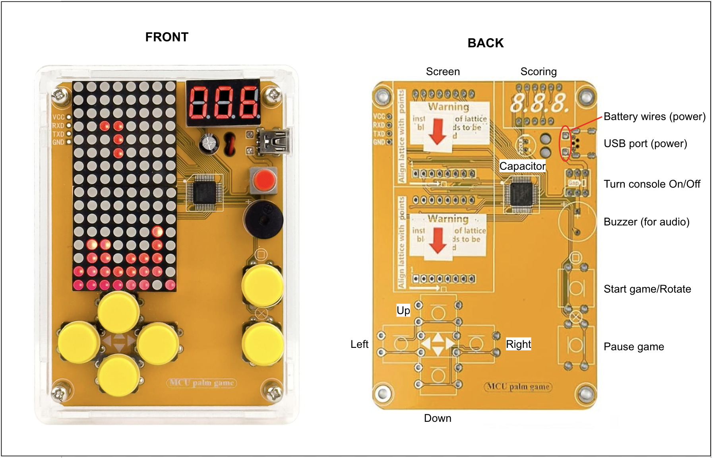

# Human Following Robotfxcvcxb
This portfolio follows my progress over the summer as I worked on numerous projects. It tracks the numerous challenges I had to overcome and notes the milestones I hit. I started my summer by putting together a retro tetris arcade console, which was a simple yet tedious task as it required much soddering. For my intensive project, I built and programmed a robot designed to follow people's hands. This was a complex process, requiring much testing, constructing, wiring, coding, and adjusting.

<!--You should comment out all portions of your portfolio that you have not completed yet, as well as any instructions:-->
```HTML 
<!--- This is an HTML comment in Markdown -->
<!--- Anything between these symbols will not render on the published site -->
``` 

| **Engineer** | **School** | **Area of Interest** | **Grade** |
|:--:|:--:|:--:|:--:|
| Zoya C. | Mission San Jose High School | Electrical Engineering | Incoming Junior

Replace the BlueStamp logo below with an image of yourself and your completed project. Follow the guide [here](https://tomcam.github.io/least-github-pages/adding-images-github-pages-site.html) if you need help.**


  
# Final Milestone

**Don't forget to replace the text below with the embedding for your milestone video. Go to Youtube, click Share -> Embed, and copy and paste the code to replace what's below.**

<iframe width="560" height="315" src="https://www.youtube.com/embed/F7M7imOVGug" title="YouTube video player" frameborder="0" allow="accelerometer; autoplay; clipboard-write; encrypted-media; gyroscope; picture-in-picture; web-share" allowfullscreen></iframe>

For your final milestone, explain the outcome of your project. Key details to include are:
- What you've accomplished since your previous milestone
- What your biggest challenges and triumphs were at BSE
- A summary of key topics you learned about
- What you hope to learn in the future after everything you've learned at BSE


# Second Milestone: Wiring/Construction


**Don't forget to replace the text below with the embedding for your milestone video. Go to Youtube, click Share -> Embed, and copy and paste the code to replace what's below.**

<iframe width="560" height="315" src="https://www.youtube.com/embed/CAFV6XYA0hU?si=pihzx5KFd-Yda4nP" title="YouTube video player" frameborder="0" allow="accelerometer; autoplay; clipboard-write; encrypted-media; gyroscope; picture-in-picture; web-share" referrerpolicy="strict-origin-when-cross-origin" allowfullscreen></iframe>

To reach this milestone, I had to put the actual robot together. This consisted mostly of screwing parts to the robot's acrylic board and then wiring all of them to the breadboard and/or the ADRUINO circuitboard I attached. To me, this project has really helped made coding and robotics less intimidating. It has showed me how simple it can be when you break all the processes into smaller, more digestable steps. There were no serious complications, but I did have to sodder one of the wires for the motor because it had snapped. The most frustrating part of this process came from screwing everything to the wrong side, meaning I had to start from scratch. Additiionally, the screws are on the smaller side, and without a wrench, it could be challenging trying to hand fix the nuts and standoffs. The wiring was pretty simple, but I needed to be careful that they were long enough and that they weren't too entangled. It's also important to make sure the ground wasn't accidentally attached to the power as they were very close together on the breadboard

# First Milestone: Testing Components

**Don't forget to replace the text below with the embedding for your milestone video. Go to Youtube, click Share -> Embed, and copy and paste the code to replace what's below.**

<iframe width="560" height="315" src="https://www.youtube.com/embed/xC3nwDxYMC0?si=RoahzrhIJZQaFLBN" title="YouTube video player" frameborder="0" allow="accelerometer; autoplay; clipboard-write; encrypted-media; gyroscope; picture-in-picture; web-share" referrerpolicy="strict-origin-when-cross-origin" allowfullscreen></iframe>


My intensive project is a robot on wheels that can follow you around. I'm relatively inexperienced in the robotics field, so I began my project by testing several parts and their corresponding programs for my first milestone in order to gain a greater understanding of them. I began by watching several videos on the ARDUINO circuitboard and how its software runs before I moved onto more hands-on projects, using the ARDUINO R3 circuitboard with jumpwires for all of them. This was pretty straightforward and simple, but I did sometimes run into some difficulties with the fragility of the adapter, especially when I wanted to run all the projects all at once. To fix this, I'd need to unplug the adapter and USB cable several times until the ARDUINO board connected to my laptop properly.

***LED LIGHTS:*** For my first test, I put together a simple circuit to test the LED lights in this set, along with the code to make the light flash.
- SCHEMATICS:

  
- CODE:
  
```HTML
//naming the pin the LED light is plugged into
const int ledPin = 9;

void setup()
{
  //initialize the digital pin as an output
  pinMode(ledPin,OUTPUT);
}

//the loop routine runs over and over again forever
void loop()
{
  digitalWrite(ledPin,HIGH);//turn the LED on 
  delay(500);               //wait for half a second (number corresponds miliseconds)
  digitalWrite(ledPin,LOW); //turn the LED off
  delay(500);               //wait for half a second
}
```

***BUZZER:*** The next project sought to find out how the buzzer worked. The setup of the two projects, as well as the coding, was very similar. The main differences could be found in the lack of a resistor (and obviously the component's function).
- SCHEMATICS:

   

- CODE:
  
```HTML
//naming the pin the buzzer is plugged into (the pin doesn't necessarily need to be a specific name, as long as the code # corresponds to the circuit's pin #  being used)
const int buzzerPin = 8;

void setup()
{
  pinMode(buzzerPin, OUTPUT);
}

void loop()
{
    digitalWrite(buzzerPin, HIGH);
    delay(1000);
    digitalWrite(buzzerPin, LOW);
    delay(1000);                  //time doesn't have to be different from LED, just a suggestion since it's loud :)
  }
```

***MOTOR:*** While having the same fundamentals as the previous projects, this was slightly more complicated as there were more componenents to the motor to put together. The motor itself had two wires that required a screwdrier in order to be plugged into the motor module.
- SCHEMATICS:

  
- CODE:
  
```HTML
const int B_1A = 9;
const int B_1B = 10;

void setup()
{
  pinMode(B_1A, OUTPUT);
  pinMode(B_1B, OUTPUT);
}

void loop()
{
  //rotates motor clockwise
  digitalWrite(B_1A, HIGH);
  digitalWrite(B_1B, LOW);
  delay(2000);

  //stops motor
  digitalWrite(B_1A, LOW);
  digitalWrite(B_1B, LOW);
  delay(500);

  //rotates motor counterclockwise
  digitalWrite(B_1A, LOW);
  digitalWrite(B_1B, HIGH);
  delay(2000);

  //stops motor (again)
  digitalWrite(B_1A, LOW);
  digitalWrite(B_1B, LOW);
  delay(500);
}
```


***IR OBSTACLE AVOIDANCE:*** This sensor detects obstacles by transmitting IR rays and receives them when a surface (of an object) reflects them back. If you opened the serial monitor, a 1 would correspond with no nearby object while a 0 would alert you of one. 

- SCHEMATICS:

   

- CODE:
  
```HTML
int irObstaclePin = 2;

void setup() {
  Serial.begin(9600);
  pinMode(irObstaclePin, INPUT);
}

void loop() {
  Serial.println(digitalRead(irObstaclePin));
  delay(10);
}
```

***ULTRASONIC SENSOR:*** This works similar to the IR sensor, but instead uses ultrasonic frequencies in order to detect how far objects.

- SCHEMATICS:

   
- CODE:
  
```HTML
const int echoPin = 3;
const int trigPin = 4;


void setup(){
  Serial.begin(9600);
  pinMode(echoPin, INPUT);
  pinMode(trigPin, OUTPUT);
  Serial.println("Ultrasonic sensor:");  
}

void loop(){
  float distance = readSensorData();
  Serial.print(distance);   
  Serial.println(" cm");
  delay(400);
}

float readSensorData(){
  digitalWrite(trigPin, LOW); 
  delayMicroseconds(2);
  digitalWrite(trigPin, HIGH); 
  delayMicroseconds(10);
  digitalWrite(trigPin, LOW);  
  float distance = pulseIn(echoPin, HIGH)/58.00;  //Equivalent to (340m/s*1us)/2
  return distance;
}
```
 

 # Starter Project
 
 
***DESCRIPTION:*** In preperation for the hardware aspects of my intensive projects, I warmed up by putting together a retro arcade console designed to play numerous games of tetris. It can be powered by either batteries or your laptop by connecting it via the USB socket. You then start a game by turning on the red power button and pressing the yellow button labeled with a square. The game is displayed on the dot matrix, and the pieces can be controlled by the four buttons labeled with arrows. While you play, the digital cube keeps track of your score, and the buzzer provides sound effects/music. The game can be ended with the button labeled X, pressing the power button, or disconnecting the power source. Every component was soddered on, and the non-electrical parts were screwed together.


***CHALLENGES:*** The main obstacle for this project was the amount of tedious soddering required. The dot matrix, digital tube, and power switch were relatively simpler. The challenge from these parts was that they had numerous parts to sodder--most of which were very close together. This meant having to meticulously sodder without accidentally connecting two holes together. Other parts, however, didn't fit into the circuitboard's holes as perfectly. As a result, I had to pay careful attention to how much sodder I added and how it was added. The wires, for example, had to be held while soddering because the wires were way too small incomparison to the holes and could also come apart and require retwisting. Additionally, the wires were much longer and would move around if not held. A slight concern was burning the circuitboard when adjusting sodder/desoddering, but this went away with time and practice. Putting together the outer parts was a straightforward task, but could sometimes be confusing since it was more difficult to tell if some screws were fully screwed.


***WHAT'S NEXT:*** Now that I've finished my starter project, I can look forward to working on my intensive project: building a human following robot. My immediate next steps are testing all the components of it, such as the sensors and motors, as well as gaining a better understanding of the ARDUINO coding software.


# Schematics 

<!--Here's where you'll put images of your schematics. [Tinkercad](https://www.tinkercad.com/blog/official-guide-to-tinkercad-circuits) and [Fritzing](https://fritzing.org/learning/) are both great resoruces to create professional schematic diagrams, though BSE recommends Tinkercad becuase it can be done easily and for free in the browser.-->


# Code
<!--Here's where you'll put your code. The syntax below places it into a block of code. Follow the guide [here]([url](https://www.markdownguide.org/extended-syntax/)) to learn how to customize it to your project needs.-->

```c++
const int A_1B = 5;
const int A_1A = 6;
const int B_1B = 9;
const int B_1A = 10;

const int rightIR=7;
const int leftIR=8;

const int trigPin = 3;
const int echoPin = 4;

void setup() {
  Serial.begin(9600);

  //motor
  pinMode(A_1B, OUTPUT);
  pinMode(A_1A, OUTPUT);
  pinMode(B_1B, OUTPUT);
  pinMode(B_1A, OUTPUT);

  //IR obstacle
  pinMode(leftIR,INPUT);
  pinMode(rightIR,INPUT);
  
  //ultrasonic
  pinMode(echoPin, INPUT);
  pinMode(trigPin, OUTPUT);
}

void loop() {

  float distance = readSensorData();

  int left = digitalRead(leftIR);  // 0: Obstructed   1: Empty
  int right = digitalRead(rightIR);
  int speed = 150;

  if (distance>5 && distance<10){
    moveForward(speed);
  }else if(!left&&right){
    turnLeft(speed);
  }else if(left&&!right){
    turnRight(speed);
  }else{
    stopMove();
  }
}

float readSensorData() {
  digitalWrite(trigPin, LOW);
  delayMicroseconds(2);
  digitalWrite(trigPin, HIGH);
  delayMicroseconds(10);
  digitalWrite(trigPin, LOW);
  float distance = pulseIn(echoPin, HIGH) / 58.00; //Equivalent to (340m/s*1us)/2
  return distance;
}

void moveForward(int speed) {
  analogWrite(A_1B, 0);
  analogWrite(A_1A, speed);
  analogWrite(B_1B, speed);
  analogWrite(B_1A, 0);
}

void moveBackward(int speed) {
  analogWrite(A_1B, speed);
  analogWrite(A_1A, 0);
  analogWrite(B_1B, 0);
  analogWrite(B_1A, speed);
}

void turnRight(int speed) {
  analogWrite(A_1B, speed);
  analogWrite(A_1A, 0);
  analogWrite(B_1B, speed);
  analogWrite(B_1A, 0);
}

void turnLeft(int speed) {
  analogWrite(A_1B, 0);
  analogWrite(A_1A, speed);
  analogWrite(B_1B, 0);
  analogWrite(B_1A, speed);
}

void stopMove() {
  analogWrite(A_1B, 0);
  analogWrite(A_1A, 0);
  analogWrite(B_1B, 0);
  analogWrite(B_1A, 0);
}
```

# Bill of Materials
Here's where you'll list the parts in your project. To add more rows, just copy and paste the example rows below.
Don't forget to place the link of where to buy each component inside the quotation marks in the corresponding row after href =. Follow the guide [here]([url](https://www.markdownguide.org/extended-syntax/)) to learn how to customize this to your project needs. 

| **Part** | **Note** | **Price** | **Link** |
|:--:|:--:|:--:|:--:|
| Tetris Arcade Console | soddering practice | $18.99 | <a href="(https://www.amazon.com/Classic-Electronic-Soldering-Tetris-Machine/dp/B07HB3HPPJ/ref=asc_df_B07HB3HPPJ?mcid=b00b7893f57d3a19abc2f6c187ac48cd&hvocijid=17279151866651341911-B07HB3HPPJ-&hvexpln=73&tag=hyprod-20&linkCode=df0&hvadid=721245378154&hvpos=&hvnetw=g&hvrand=17279151866651341911&hvpone=&hvptwo=&hvqmt=&hvdev=c&hvdvcmdl=&hvlocint=&hvlocphy=9032171&hvtargid=pla-2281435179298&th=1)"> Link </a> |
| SunFounder 3-in-1 Starter Kit for ARDUINO UNO R3 | car parts, including motorized wheels, universal wheel, screws, acrylic board, etc (all other items besides starter project components can be found here too) | $59.99 | <a href="(https://www.amazon.com/SunFounder-Compatible-Tutorials-Including-Controller/dp/B0B778L1DZ/ref=sr_1_1?crid=39SRRE6NUPJ6I&dib=eyJ2IjoiMSJ9.D9LrCZJnua_keVMLJz2FWuvSD9IFJ4iV0OAGcDwLKXQDokdkjSabj-88ReuH07RR4Rbu0Wgxnox9Q0WPLRKJJQ.hO2JiQIlAVZg-_K_CWNuP5PwWk7o5Y6-l8S8KmZaGxA&dib_tag=se&keywords=sunfounder+3+in+1&qid=1750974630&sprefix=sunfounder+3+in+1%2Caps%2C165&sr=8-1)"> Link </a> |
| ARDUINO R3 Board | circuitboard for robots + all testing  | $8.99 | <a href="(https://www.amazon.com/ATmega328P-Arduino-Compatible-Arduino-Voltage-Compatible/dp/B0D83J2TJJ/ref=sr_1_4?crid=329T2WYWAI29F&dib=eyJ2IjoiMSJ9.PA5bTsvC-SwWQIJ_zNvJdvU6r6Xl6cFkTsg5XnmAvAFh41QZewvvJmzXkKbv8m0EyyZbgTGmcQkdD3h3Zpwrt6nbN28WBbHnnhMSzQhGCCfOKTKHm0BxDPjmC0DpAZYl_xEuBuNL9Gkkawj8466LPtGLDJH1HqkrpThxD1FuFVEXG0qAFSEVM-9ib-QBDKtePlFQ_YDxs6LRa144m9JZS_cEvc1FsIxAabpavImW1No.0frZfOYgexyEQLRvyVLwEK52rqLFle6n8p3cX1XnVuk&dib_tag=se&keywords=arduino%2Br3%2Bcircuit%2Bboard&qid=1750973672&sprefix=%2Caps%2C93&sr=8-4&th=1)"> Link </a> |
| Breadboard | connects all parts to circuitboard | $6.19 | <a href="(https://www.amazon.com/Chlmetf-Breadboard-Breadboards-Bundles-Flexible/dp/B0DSS4QWM1/ref=sr_1_11?crid=M4P9SETSWDAN&dib=eyJ2IjoiMSJ9.5Z5yTwL-oa1r18Ah_zf9OXg0u1AVX54R3VfgSdqpBoSGPnQIrACToU02yfhw-Mp8QzU0B4nbdiUiYNfL_A1cebv19IBUJa73iSfGnpVNzbkpuE8-EML7ngxL9O3GmzyCW2BOv1hpjJrqa5_6ZwTNqKmEVSnGiisEYr0cX4It9WDbCu_yWZ7GO5E679U3phBnBMN28_jIF3D6NrM05ehNEqycwkOJK9Rz15s804YNm8Y.l6EJBnKvDl9H8tJqjhM2MX-_0Wu6xl-mmCBb3BpbON8&dib_tag=se&keywords=breadboard&qid=1750974317&sprefix=breadboar%2Caps%2C212&sr=8-11)"> Link </a> |
| Jumper Wires | connecting components to boards | $6.98 | <a href="(https://www.amazon.com/Elegoo-EL-CP-004-Multicolored-Breadboard-arduino/dp/B01EV70C78/ref=sr_1_1?crid=3B0JET5S3B8KZ&dib=eyJ2IjoiMSJ9.I3nSspk5onl8Jong0G-0Eej0s1agLXJoNbNWfIFXRRAY9IgBhFFYUU-ai_9I1dEIHE49Z9DPtLxKexe54VQGbkpoX-RHudyEMxZWyHI-uCHaL24mZOYSxXIHBkGbJpkLxLrh-Fxi2CI5fXiycQvwNnMKoVyBi0k--RiSy6f0H5V1Z8Fvtfz6Ad6SPNK8g-JuszLI9IES2gmnwmp4zH_w2aV0a-BSGUA-VWdEyFeRi6U.wTsweHoLGXJAYK1mGwHWTOWqxpJfkr7-IrP8NWm8dIs&dib_tag=se&keywords=jumper+wires&qid=1750974887&sprefix=jumper+wire%2Caps%2C171&sr=8-1)"> Link </a> |
| L9110 Motor Driver Module | drives both motors simultaneously | $4.99 | <a href="(https://www.amazon.com/VKLSVAN-H-Bridge-Channel-Stepper-Controller/dp/B0DQPRLTBD/ref=sr_1_4?crid=2FQI8NJEQ4DC0&dib=eyJ2IjoiMSJ9.3hJQtz2H_a0DvMbcXALLpQhQuKIy7jZ9cjX7Fq0q8hTFnY8rwOs17t5iJ_i326kNN-K_ZXtXji34V8VsE4ZSs6wjD4yU6Lc-5o2elh7g43QzWB-_YL_YAcC9RcWikX1_-ncVU66XAJnNr8EPbtesW8heIlLjy0AN1NvMl3LUuTWoRhGwC7SSEnuQsjT-HKaX3toeODkH8v1t0PWGLrTrTKtx5WRfqT7Ipl-pdXCRj9A.lHilYeAXkbHlIpGbXfGZymamMVciccmyZxULci5a0HE&dib_tag=se&keywords=L9110%2BMotor%2BDriver%2BModule&qid=1750973920&sprefix=l9110%2Bmotor%2Bdriver%2Bmodule%2Caps%2C113&sr=8-4&th=1)"> Link </a> |
| TT Motor | steers wheels | $6.99 | <a href="(https://www.amazon.com/Diann-Motor-Gearbox-200RPM-Ratio/dp/B0BR7S2TRY/ref=sr_1_6?crid=16M86V4H4P4ZK&dib=eyJ2IjoiMSJ9.VFvmjZ6X2lLerHG6wM2_Zwfl36qWgxmR6GprDkLz0198ub_96M_N_PwwtBiw0QYHCqn5D2B56Ne-AT1_2_6bqMC0Q0hd9BRdbp2LcLLevHT96hwQTEU-zadr0u-ZAdGezeOydZa2ONGgoeo2k2jBtctBSUwxtLXPJHBAdKNTZ1II-w8MaXdSBJoM3guWAm-Mi9O5KtjSWC9vU3uxE0e2oKa94nyrzgoKzem-1qBLHqPfSKCKSHFiF6LeIm-Z2YW8hgAhMYIaA1eEl7Rh9XjzJy1dcLrO9ryUF3z7htioAJM.ynogUApaD90MYh606c3q_q7LJGSOhP8hA-8U-XCv51o&dib_tag=se&keywords=TT%2Bmotor&qid=1750974073&sprefix=tt%2Bmotor%2Caps%2C183&sr=8-6&th=1)"> Link </a> |
| Ultrasonic Sensor | detects distance from an object | $6.99 | <a href="(https://www.amazon.com/WWZMDiB-HC-SR04-Ultrasonic-Distance-Measuring/dp/B0B1MJJLJP/ref=sr_1_3?crid=10A3ZPKR43D2P&dib=eyJ2IjoiMSJ9.0VlpR5An1rDHrKsyEwXFZf4g67ELu997flI4iC_UhX5L30tFFCz7cQnhbt9liS7tkdN6s-XqAfzVphzD4J46FFVc2fHpLn9TkIT5rXIQyoDSBnLaaJ5gwJylrYoZocO-guoy7yUnUwiAdbYg_BYg4SwkYhIAueZ6Cksh2S7Cmyb_TpuA8P5-1IzqJpUljr2yTS_qt2XyEMdpLjduaSUZZ5dKlADLPycmJKbtg2C3ZK4.mVJ2U5mtWMNF4pQTBDcZBgM0B9PM8qa0qv1w4K7Ln2g&dib_tag=se&keywords=Ultrasonic+sensor&qid=1750974160&sprefix=ultrasonic+sensor%2Caps%2C151&sr=8-3)"> Link </a> |
| Obstacle Avoidance Module | detects if an object is within a desired range | $5.99 | <a href="(https://www.amazon.com/WWZMDiB-TCRT5000-Reflective-Photoelectric-Avoidance/dp/B0BDDBM2TR/ref=sr_1_7?crid=314JNOY703NDE&dib=eyJ2IjoiMSJ9.Xj9IhGOOzwBMNc-6r4uk6H9Ub2nW5L8WBfqhJ996lyBNK3fNnzpYFisQw2CqYnEjIxmlNuHf7ynVCCJfSD5bgGLlhk_Of7fxhbvbLW-gSWKPRCHMqOKkdK1gZZSnoqiaw_FvCGdWnA0efW6-DiwmphUaMb6C3Cz734MLzq7pJW7_3l_XWruO9I8vRglpVIpd2KGaqEkLRP31BA-GHUYbVT6K8T0JHdSm6X1T33Up0QJIoJh14CuYdC7lImxql5b3vlhH8gpVe8Kyb4mpbnZwrQQ0IuMhGDvkbKLt5I5LqAw.qeLNnFe9YbXkYswh7sN4EO9Umc3Q3AwprN-2CzB35z8&dib_tag=se&keywords=Obstacle+Avoidance+Module&qid=1750974201&sprefix=obstacle+avoidance+modul%2Caps%2C139&sr=8-7)"> Link </a> |
| Resistor | prevents shortcircuits (ensures voltage isn't too high) | $4.59 | <a href="(https://www.amazon.com/California-JOS-Resistance-CJ50-004-220/dp/B0BDKQSZHM/ref=sr_1_3?crid=PW9C3IZP9TJ5&dib=eyJ2IjoiMSJ9.pq8IXZtwkjU13efAoUQ012KAyknNA0lTscBiHFNwGQe5-6dKzzkxrUTVKn96kzmc9mUyL5d3GjDGP7PgotUTiRWI6uuaLqfyWFfV8WfPQW8rmwQScFRDdhyqcJOUtEaXguIbR8CIxvDeL9FuPxKty9hBcapiema5smYGMBmHVCNAba27FRHshpVaI3D_Cpg3vF4KTWWYFHExPrA_urVWR0y005THHbIj3AXmwkV58QU.0qXsOr9uGCg3n7iic8n96X2SAtplqLJGPDf8mtRGceM&dib_tag=se&keywords=220+ohm+resistor&qid=1750974966&sprefix=220%2Caps%2C149&sr=8-3)"> Link </a> |
| LED light | testing codes & parts with lights | $3.97 | <a href="(https://www.amazon.com/California-JOS-50-PCS-Colorful/dp/B0CR886L92/ref=sr_1_6?crid=2UDHKIDZ24PB8&dib=eyJ2IjoiMSJ9.8j3OanSWHKtLCAXnwT0t6BxCPwBne4LiOPlF2sgWgCc-HBlLRceMGDWPjPhKdl7WXB798eC9bWNKcfH490OAW80OvTxrBoxemYwLxAVes6R87_2-aojU2TzoSUYfQdn3xTypxtNLWch392Ch-q9o5EPHyCsfJDBLCWyRxOqtjllRgtfBy2KN51Wklhkp4jsw-RtcSfOeTeEKwYFTm-YeHYzisNQl6V5UB-VgEEH7Hmr2SJchTUTqX5wiUjF3QT6Mp1JHXDCCPDj9-EbssudHBTwutfaD-Sj4WWF72y0ef0c.-Y5mAuvbwrc452eW5sZZT9y3Z6iXM1D5HUG6OVrER5k&dib_tag=se&keywords=led%2Blight%2Bcircuit%2Bboard&qid=1750975066&sprefix=LED%2Blight%2Bcircuitbo%2Caps%2C132&sr=8-6&th=1)"> Link </a> |
| Buzzer | testing codes & parts with sounds | $5.99 | <a href="(https://www.amazon.com/Cylewet-Terminals-Electronic-Electromagnetic-Impedance/dp/B01NCOXB2Q/ref=sr_1_7?crid=FWFGOHKNHVM8&dib=eyJ2IjoiMSJ9.woH-ybv0Q271j8do6pCKsq8U4p2Q6dw5bj_mKVlHdy88rcT8jPbnakpIbPRzQ0oquX7QhROJtJetQh5uoaOL9Jy96PCdzIjs_7fN9Ryqx_VwTH-09dN5AKGh8R5Ww8v_z17QVwstWVtd1E9qboZWScWF7JKhj6jm9Sq07sXte3sucaRsaEJ6sE_CUYIiHodan0BNIyJ8I-eVk7NvKMvw8uJA-UnCBfnIoHKrADG9pix8kw8bW5NXLzcSaDgkLV6XcQpWD3tSBD5347bUvL1JxQHVqIBbC5GuLNIuPx8QBQ8.5JUaWfClyDYZ56Wxo4EodWmx6v5kmn2bXPxSN6MFTxc&dib_tag=se&keywords=buzzer+for+circuits&qid=1750975152&sprefix=buzzer+for+circuit%2Caps%2C137&sr=8-7)"> Link </a> |


# Other Resources/Examples
One of the best parts about Github is that you can view how other people set up their own work. Here are some past BSE portfolios that are awesome examples. You can view how they set up their portfolio, and you can view their index.md files to understand how they implemented different portfolio components.
- [Example 1](https://trashytuber.github.io/YimingJiaBlueStamp/)
- [Example 2](https://sviatil0.github.io/Sviatoslav_BSE/)
- [Example 3](https://arneshkumar.github.io/arneshbluestamp/)

To watch the BSE tutorial on how to create a portfolio, click here.-->
