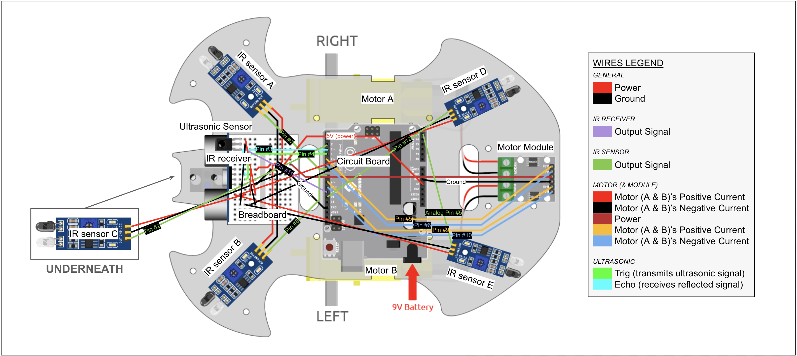

# Multimode Tracking Robot
This portfolio documents my progress over the summer as I worked on a series of hands-on projects, chiefly, the multimode tracking robot for my intensive project. It highlights the challenges I faced, the milestones I achieved, and the skills I developed along the way. I started my summer by putting together a retro tetris arcade console, which was a simple yet tedious task since it required much soldering. For my intensive project, I built and programmed a robot initially designed to follow people around, though it could later be remotely controlled. This was a complex process that involved much testing, constructing, wiring, coding, and adjusting. The main sensors I used were infrared sensors to detect if objects nearby and an ultrasonic sensor to interpret the distance of objects from itself. The modifications I decided to implement after successfully building the robot consisted of ensuring the robot would stop before reaching any edges, instructing it to move backwards when it got too close to objects/people, allowing it to turn around when it sensed something behind it, and being able to steer it from afar. For the last modification, I added on an IR receiver to pick up signals from the remote controller. Due to my inexperience, the main challenges for modifying the robot came from trying to understand how to accomplish what I wanted my robot to do--and what went wrong or right in the process.

| **Engineer** | **School** | **Area of Interest** | **Grade** |
|:--:|:--:|:--:|:--:|
| Zoya C. | Mission San Jose High School | Mechanical Engineering, Electrical Engineering | Incoming Junior

<!--Replace the BlueStamp logo below with an image of yourself and your completed project. Follow the guide [here](https://tomcam.github.io/least-github-pages/adding-images-github-pages-site.c++) if you need help.**-->


  
# Modifications 
<iframe width="560" height="315" src="https://www.youtube.com/embed/l95S_1xF4oE?si=0q1akrfpHWUPkLec" title="YouTube video player" frameborder="0" allow="accelerometer; autoplay; clipboard-write; encrypted-media; gyroscope; picture-in-picture; web-share" referrerpolicy="strict-origin-when-cross-origin" allowfullscreen></iframe>
For all of the following schematics, I  utilized a diagram I found on [SunFounder](https://docs.SunFounder.com/projects/3in1-kit-v2/en/latest/car_project/car_remote_control_plus.html), but I revised it on Google Drawings to illustrate the modifications I made to the robot, its components, and its wiring.

## Modification #5: Remote Control
**DESCRIPTION:**
Although the main premise of my project was that the robot would be able to follow me, I thought it would be cool if it was also remotely controlled. After modifying the code I found on [SunFounder](https://docs.SunFounder.com/projects/3in1-kit-v2/en/latest/car_project/car_remote_control_plus.html), this robot was able to be steered in any direction, change its speed in the 0-255% range, switch to the following mode, and, of course, stop. The remote works by transmitting IR signals that are each correlated to a certain button being pressed (assigned by code). The IR receiver then picks up these signals and, like the other sensors, the robot will execute commands assigned to each button as instructed. A cool way to test the remote is actually sending signals without the serial monitor is to point it at one of the obstacle avoidance sensors. Once a button is pressed, the sensor's receiver will get it and the light indicating that the sensor picked up a signal will turn on. (It is usually used to receive transmitted waves reflected back by an object but it can receive any IR signal.)   

**CHALLENGES:**
The main challenge came from never working with a remote control or this type of IR receiver, so I had to do some testing to understand it first. Unlike the IR sensor, it does not have a light to indicate it received anything, so I needed to use the serial monitor for to ensure it was working. One issue I realized when testing is that it could only function when its signal pin is connected to a digital pin on the board. However, I had used up all the digital pins on the board, so I resolved this to moving one of the IR sensor output pins to an analog pin. Thankfully, I did not have to change anything in the code, besides redefining the pin it is connected to. You may be wondering why I did not move it to another normal pin because the schematics show that pins #0, #1, and #13 are empty. However, using pins #0 and #1 would mess with signal reception and transmission. Pin #13 was connected to the Arduino board's LED light and had to always be on high frequency, which meant the IR sensor would always be receiving a high signal (to keep the board's light on). I was initially worried about the ultrasonic sensor or wires being in the way of the IR signals, but those proved to not be a problem at all.

**WHAT'S NEXT:**
I have finally finished all my modifications, and it is time to wrap up my project. All I have to left is touch up my documentation and prepare for the presentation of my robot.

### Modified Schematics
 

### Remote Control


## Modification #4: Touchups
**DESCRIPTION:** 
While running tests, I noticed there would sometimes be problems with the motor: only the right one would work at times. Upon more troubleshooting, I realized this would only occur if the robot was powered by the battery (as opposed to my laptop). I tried a variety of solutions to this problem but ultimately decided to stick with the 9V battery and simply replace it when needed. However, replacing the battery also made me realize that the motors would work much more efficiently when functioning at its peak. This meant I had to recalibrate a lot of the code I had setup. This included adding a new speed setting for when the robot is backing up. Essentially, the robot would back up too fast, moving into the range where it should move forward. Then, it would move forward and end up too close again. This created a sort of rocking motion and drained the battery rapidly. Slowing down the back up speed meant it would back up right into the range where it was meant to stay in place. I did try messing with the distance ranges, but I found this to be the most efficient and simple solution. Another thing I altered was shortening the delay between the back sensors sensing something and the motors reacting to it. This is because with the higher current, the robot would overspin, resulting in a ~270 degree spin rather than 180. While adjusting with the battery settings, I ended up keeping the new battery on the top side of the robot because it would get less tangled with other wires. However, its relative location on the robot still remained the same (under the circuitboard). Additionally, I decided to store a spare battery where it used to be.

**CHALLENGES:** 
The main challenge from this modification was figuring out how to solve the battery issue. Not only did I exhaust every possibility, but each and every alternative required much soldering to even test because each battery pack needed female ends; sometimes, I even needed to solder battery packs together. Though this seems like the most simple part of my project, this modification actually took the longest--more than any other modification or milestone--due to all the trial and error, as well as all the soldering each test required. At first, I thought it was a power issue, so I tried replacing the battery. When the battery still ran out relatively quickly, I tried to power the motor driver and circuitboard differently. However, when I used 4.5-5V to power the motor module, I came across the same problem of not having enough power. If I used a higher voltage, there would be too much power, and it did not work. (For higher voltages, I tested 6, 7.5, and 9V.) Next, I tried increasing the voltage to power everything together, but anything more than 9V would be too much power, and the circuitboard would overheat in a matter of seconds. (I tested 10.5 and 13.5V.) When I finally tried a power bank, I realized this was actually a current issue rather than a power issue. At its maximum capacity the 9V battery could supply a ~800mA current, which was enough to power everything. However, it could not sustain this for too long, which is what resulted in only one of the motors working. To solve this, I had three options: use a power bank, use parallel circuits with two batteries, and/or replace the battery frequently. The power banks I had available were too bulky (and would either unbalance the robot or mess with the movement if I were to hold onto it). To further narrow it down, a parallel circuit was too unstable given it was basically just connecting two batteries together. As a result, I settled for keeping the 9V battery but changing it more frequently. If I had more time, I might have tested out a smaller power bank.

**WHAT'S NEXT:** 
Now that I have made sure everything functions at the desired speed and distance, I have time for one more modification. I would like to be able to remotely control the robot. This obviously clashes with the whole "moving to follow you" concept, so I will make sure to add this as a setting to the remote control. This way, I can choose between the two modes.


## Modification #3: Turning Around
**DESCRIPTION:** 
For this modification, I wanted to ensure the robot could react when there was anything behind it in order turn around towards it. I used the IR sensors to accomplish this since I am more familiar with them, and their function would be the exact same as the ones on the front. For the code (after assigning, defining, and interpreting the sensors and their readings), I updated the if/else statement to make the robot turn around if none of the sensors (beside the edge detector) sensed anything. I then added an extra set of motor instructions inspired by the original turning code--but this time at a faster speed--to make the robot spin in roughly the same time it takes for the robot to turn normally. However, I still did extend the sensor interpretation to motor action delay to ensure it could turn completely when needed.

**CHALLENGES:** 
Much of the challenges I faced, actually, did not really have anything to do with the modification itself. At first, there were no more female-male wires, so I had to improvise by attaching and taping together a female-female to male-male. However, some of them were too long, so I  had to solder some to make them smaller and wait until there were more female-male wires. However, attaching these wires did cause some new problems: the wires would get crowded, so I had to be attentive to every change I made, and the wires being so crowded resulted in me accidentally moving a motor wiring until its end snapped off. This meant I had to completely detach this motor to re-solder a new end onto it. (I cannot just get a new wire because these wires are attached to the motor.) A challenge I did face was when coding the turning around instructions, the robot would not turn around enough in the given time no matter how high the speed was. To solve this, I watched some videos on the code I was using. This helped me realize I could extend the delay between the sensors reading a nearby object and the motors following the given instructions for each scenario. This meant the robot would turn around for longer, until its sensors later no longer sensed something nearby. With the combined increased speed and delay, the robot could quickly turn around when something was detected behind it.

**WHAT'S NEXT:**
I have yet to decide what I want the next modification to be. However, I have noticed that the motors can be inconsistent when the robot was powered solely by the battery (as opposed to connecting it to my laptop). I need to figure out if the battery is either supplying too much or not enough power, so I would like to work on fixing this next before modifying the robot any further. 

### Modified Schematics


## Modification #2: Backing Up
**DESCRIPTION:** For this modification, I coded the robot to move backwards if it got too close to me. There were no changes in the wiring since all I had to do was figure the instructions that would make the wheels move backwards, and then assign this instruction to a certain distance range. I chose this because I noticed the robot would sometimes bump into my hand due to the speed I wanted it to go at. The instruction for moving backwards the opposite of moving forward: the right motor's positive and the left motor's negative current would work while the other currents' output would be 0. Due to the updated if/else statement, the robot would execute this instruction if the ultrasonic sensor detected something within 6 cm of it. Though I ultimately decided against it, I did try toying with the speed too. (The robot felt slow if I reduced the speed enough to prevent the issue.) 

**CHALLENGES:** The difficulties of this modification was to find the right distance range for moving forward and backwards. I did not want them to overlap or be too close because the robot would go haywire and looked like it was attacking me. However, as I messed with them, I realized I did not want the ranges to be too far from each other. This would make the robot run more smoothly, and the "attacks" would be softened to appear more like nudges. I ultimately decided 6 cm was a good enough distance from my hand because at this range, the robot would almost be touching me. I decided on the forward distance accordingly, given 3cm was too great and 1cm was too small a distance.

**WHAT'S NEXT:** After this, I want to add sensors to the back of the robot and modify it to turn around if it detects anything behind it. This will be slightly trickier because I might need to rewire a lot of the breadboard to make space for the new ground wires these sensors will use. I will also have to figure out what instructions I have to code for the motor to make the robot turn longer than usual and how the if/else statement needs to be updated.


## Modification #1: Detecting Edges
**DESCRIPTION:** When initially testing the robot's ability to follow me, one thing I would always need to be wary of is to make sure I would not accidentally lead it off the table. As a result, I wanted my first modification to be adding an IR sensor on its bottom side (in the front) to ensure it would stop before any cliffs, even if it sensed me. After all, what good is a pet robot with no survival instincts? In order to achieve this, I coded the first priority of the if/else statement to be that the following instructions could only be executed if the bottom IR sensor deteced something below it.

**CHALLENGES:** One of the major challenges was that this modification was completely my own design. This meant I would have to figure out how and what sensor to add and how to code it. What made it even more difficult was that prior to this program, I had no coding or circuit-building experience. This meant any coding I did was based off patterns I had noticed from the code I had already been using. The same was true for the wiring. The sensor I decided to use was the IR sensor, which I tweaked slightly to be facing the ground. For the code, I modified it by instructing the robot to stop if this new sensor did not detect anything below it; the robot could not carry out its steering commands (left, right, forward), even if it sensed something nearby, so long as there was some sort of edge before it. 

**WHAT'S NEXT:** Now that I have completed my first modification, I plan on moving onto more difficult ones. I am unsure which one I would like to begin with, but I have many in mind. Examples include adding sensor to its back to make it turn around and/or move backward, make it back up when it is too close to something, and making it remote control. I would like to start easy and slowly build myself up, meaning I will likely start with making it back up when it is too close.

### Modified Schematics


# Final Milestone: Coding

<iframe ="560" height="315" src="https://www.youtube.com/embed/6Max72kHgqk?si=7P0bIYm07S1jpWlh" title="YouTube video player" frameborder="0" allow="accelerometer; autoplay; clipboard-write; encrypted-media; gyroscope; picture-in-picture; web-share" referrerpolicy="strict-origin-when-cross-origin" allowfullscreen></iframe>

**DESCRIPTION:** To wrap up this project, I had to implement the code in order to make it follow my hand. I had to make sure all the pins matched up and all the signals were read and interpreted properly. I also had to make sure all the components were properly defined, interpreted, assigned, etc. The directions to follow my hand from the front was based on ultrasonic sensor's readings. If it detected something within 5-20 cm of the sensor, it would move towards it until it was out of range. It could also turn left or right to face me if either of the IR sensors detected something near it (and then it would move forward based on the previous instructions for the ultrasonic sensor readings).


**CHALLENGES:** Since the pins are all very close together on the circuitboard, it is also very easy to misalign them physically. The trickiest part was debugging due to the sheer amount of instructions and wires. I debugged using the serial monitor to print out what it read from the sensors in order to figure out which sensors were working and which ones did not. After I figured out which sensors and/or commands were not working, I had to make sure each and every one of its wires and its parts (eg. for the IR sensor, the transmitters and receivers might need to be tweaked) were working and plugged in correctly. One obstacle was that for female-female jumper wires, the one with rectangular ends as opposed to the rounded ones tend to be more reliable. While debugging, I noticed the rounded ends were causing power issues for the sensors. The rectangular ending wires stay in place better and they also plug in all the way properly. However, it is important to be aware that their ends are more flexible, so they can also snap off more easily (which did happen when attaching the motor wires during Milestone #2). 


**WHAT'S NEXT:** Now that I know how to build, code, and troubleshoot these parts, I would like to modify the robot to be able to detect when I am behind it to either back up or turn around to continue following me. Now that I have finished building my project, the next thing to do is add my own modifications.


# Second Milestone: Wiring/Construction

<iframe ="560" height="315" src="https://www.youtube.com/embed/_HQk5TEfqqU?si=H7X6gfRgMYlOd3nm" title="YouTube video player" frameborder="0" allow="accelerometer; autoplay; clipboard-write; encrypted-media; gyroscope; picture-in-picture; web-share" referrerpolicy="strict-origin-when-cross-origin" allowfullscreen></iframe>

**DESCRIPTION:** To reach this milestone, I had to put the actual robot together. This consisted mostly of screwing parts to the robot's acrylic board and then wiring all of them to the breadboard and/or the ADRUINO circuitboard I attached. SunFounder provided a [tutorial to build the robot](https://docs.SunFounder.com/projects/3in1-kit-v2/en/latest/car_project/car_assemble.html), as well as the [Follow You Hand project's schematics](https://docs.SunFounder.com/projects/3in1-kit-v2/en/latest/car_project/car_following.html). To me, this project has really helped made coding and robotics less intimidating. It has showed me how simple it can be when I try breaking all the processes down into smaller, more digestable steps. 


**CHALLENGES:** There were no serious complications, but I did have to solder the positive current wire for Motor A to a new male end because its original male end had snapped. The most frustrating part of this process came from screwing everything to the wrong side, meaning I had to start from scratch. Additionally, the screws were on the smaller side, so without a wrench, it could be challenging trying to hand fix the nuts and standoffs. The wiring was pretty simple, but I needed to be careful that they were long enough and were not too entangled. It was also important to make sure the positive and negative wires for the motor were plugged into ground and power circuits accordingly to prevent short-circuiting. Similar to this, it is important to make sure the ground part of the circuit was not accidentally attached to the power part as they were very close together on the breadboard, which would also result in a short circuit. 


**WHAT'S NEXT:** Now that I have completed wiring and construction, I need to figure out and test the codes in order to make the robot work. I may need to make my own additions to it for debugging in case anything goes wrong.

## Schematics 

<!--Here's where you'll put images of your schematics. [Tinkercad](https://www.tinkercad.com/blog/official-guide-to-tinkercad-circuits) and [Fritzing](https://fritzing.org/learning/) are both great resoruces to create professional schematic diagrams, though BSE recommends Tinkercad becuase it can be done easily and for free in the browser.-->


# First Milestone: Testing Components

<iframe ="560" height="315" src="https://www.youtube.com/embed/CAFV6XYA0hU?si=x979owAFFp9I4_uh" title="YouTube video player" frameborder="0" allow="accelerometer; autoplay; clipboard-write; encrypted-media; gyroscope; picture-in-picture; web-share" referrerpolicy="strict-origin-when-cross-origin" allowfullscreen></iframe>

**DESCRIPTION:** My intensive project is a robot on wheels that can follow you around. I am relatively inexperienced in the robotics field, so I began my project by testing several parts and their corresponding programs for my first milestone in order to gain a greater understanding of them. I did this with the help of schematics, codes, and video instructions from [SunFounder](https://docs.SunFounder.com/projects/3in1-kit-v2/en/latest/Arduino_video_course/Arduino_video_course.html). I began by watching several videos on the Arduino circuitboard and how its software runs before I moved onto more hands-on projects, using the Arduino R3 circuitboard with jumper wires for all of them.

**CHALLENGES:** This was pretty straightforward and simple, but I did sometimes run into some difficulties with the fragility of the adapter, especially when I wanted to run all the projects all at once. To fix this, I would need to unplug the adapter and USB cable several times and reconnect the Arduino board to my laptop properly. 

**WHAT'S NEXT:** Now that I have reached this milestone, I need to build the robot and attach all the wires to connect all the parts together in order to achieve my second one. Since I have learned how each of these parts work, it will be easier to improvise if needed.

## LED Light
For my first test, I put together a simple circuit to test the LED lights in this set, along with the code to make the light flash. LEDs, short for light-emitting diodes, work by running a current througha the diode, which is semiconducting. This then emits photons, which produces light. Since the light has a positive and negative side, it is very important to make sure that the negative node is connected to the ground while the other is connected to power. The resistor ensures the voltage is not too high, as the light does not need the 5 volts the circuitboard offers. Too much voltage would result in the light burning out and maybe even wires melting.
  
### SCHEMATICS:

   

## Buzzer
The next project sought to find out how the buzzer worked. The setup of this and the LED project, as well as the coding, was very similar. The main differences could be found in the lack of a resistor (and obviously the component's function). The buzzer also has different polarities, like the LED light, so it is important to check for the same things. The buzzer works by powering two electrodes, which causes the piezoelectric material in a disk within it to deform. When this disk moves, it produces sound. 
  
### SCHEMATICS:

  

## Motor
While having the same fundamentals as the previous projects, this was slightly more complicated as there were more componenents to the motor to put together. It requires an additional motor module to provide a stronger signal because the Arduino board does not have enough power for the motor to work. Though it has enough voltage for two motors (as you will see later), I decided to test only one for now. The motor itself had two wires that required a screwdriver in order to be plugged into the motor module. These wires were for the motor's positive and negative currents to control which way the motor would rotate.
  
### SCHEMATICS:

  

## IR Obstacle Avoidance
This sensor senses obstacles by transmitting infrared (IR) rays and receives them when a surface (of an object) reflects them back. If the serial monitor was opened, a 1 would correspond with no nearby object, while a 0 would alert me if there was. One of the green lights on the sensor also turns on to show the same thing. Due to the binary nature of this component, the it is coded with Digital Write. Digital Write outputs a digital signal to a digital pin and has only two states: 0 (0V) or 1 (5V). It is important to differentiate this light from the power light, which indicates the sensor is working. Both will be labeled accordingly.
  
### SCHEMATICS:

  

## Ultrasonic Sensor
This works similar to the IR sensor, but instead uses ultrasonic frequencies in order to detect how far objects are. This works by emitting sound waves (too high for human ears to pick up, don't worry), and receiving these waves when they are reflected back. The distance from sensor to object is then calculated (in centimeters) based on the distance the sound traveled divided by 2 to account for the sound wave traveling to the object *and* being reflected back. How far the sound wave traveled is based on how long it took for the sound wave to travel there and back, multiplied by the speed of sound constant (~340m/s).
  
### SCHEMATICS:

  

# Starter Project: Tetris Arcade Console


<iframe width="560" height="315" src="https://www.youtube.com/embed/xC3nwDxYMC0?si=Qx-B4X6S6Iq_OcWs" title="YouTube video player" frameborder="0" allow="accelerometer; autoplay; clipboard-write; encrypted-media; gyroscope; picture-in-picture; web-share" referrerpolicy="strict-origin-when-cross-origin" allowfullscreen></iframe>
 
**DESCRIPTION:** In preparation for the hardware aspects of my intensive projects, I warmed up by putting together a retro arcade console designed to play numerous games of tetris. It can be powered by either batteries or a laptop by connecting it via the USB socket. A game can then be started by turning on the red power button and pressing the yellow button labeled with a square. The game is displayed on the dot matrix, and the pieces can be controlled by the four buttons labeled with arrows. While playing, the digital tube keeps track of the score, and the buzzer provides sound effects/music. The game can be ended with the button labeled X, pressing the power button, or disconnecting the power source. Every component was soldered on, and the non-electrical parts were screwed together.


**CHALLENGES:** The main obstacle for this project was the amount of tedious soldering required. The dot matrix, digital tube, and power switch were relatively simpler. The challenge from these parts was that they had numerous parts to solder--most of which were very close together. This meant having to meticulously solder without accidentally connecting two holes together. Other parts, however, did not fit into the circuitboard's holes as perfectly. As a result, I had to pay attention to how much solder I added and how it was added. The wires, for example, had to be held while soldering because the wires were way too small in comparison to the holes and could also come apart and require retwisting. Additionally, the wires were much longer and would move around if not held. A slight concern was burning the circuitboard when adjusting solder/desoldering, but this went away with time and practice. Putting together the outer parts was a straightforward task, but could sometimes be confusing since it was more difficult to tell if some screws were fully screwed.


**WHAT'S NEXT:** Now that I have finished my starter project, I can look forward to working on my intensive project: building the robot. My immediate next steps are testing all the components of it, such as the sensors and motors, as well as gaining a better understanding of the Arduino coding software.


# Code
## First Milestone: Testing Components
### LED Light

```c++
//naming the pin the LED light is plugged into
const int ledPin = 9;

void setup()
{
  //initialize the digital pin as an output
  pinMode(ledPin,OUTPUT);
}

//the loop routine runs over and over again forever
void loop()
{
  digitalWrite(ledPin,HIGH);//turn the LED on 
  delay(500);               //wait for half a second (# corresponds miliseconds)
  digitalWrite(ledPin,LOW); //turn the LED off
  delay(500);               //wait for half a second
}
```

### Buzzer
  
```c++
//naming the pin the buzzer is plugged into (the pin doesn't necessarily need to be a specific name, as long as the code # corresponds to the circuit's pin # being used)
const int buzzerPin = 8;

void setup()
{
  pinMode(buzzerPin, OUTPUT);
}

void loop()
{
    digitalWrite(buzzerPin, HIGH);
    delay(1000);
    digitalWrite(buzzerPin, LOW);
    delay(1000);                  //time doesn't have to be different from LED, just a suggestion since it's loud :)
  }
```

### Motor
  
```c++
const int B_1A = 9;
const int B_1B = 10;

void setup()
{
  pinMode(B_1A, OUTPUT);
  pinMode(B_1B, OUTPUT);
}

void loop()
{
  //rotates motor clockwise
  digitalWrite(B_1A, HIGH);
  digitalWrite(B_1B, LOW);
  delay(2000);

  //stops motor
  digitalWrite(B_1A, LOW);
  digitalWrite(B_1B, LOW);
  delay(500);

  //rotates motor counterclockwise
  digitalWrite(B_1A, LOW);
  digitalWrite(B_1B, HIGH);
  delay(2000);

  //stops motor (again)
  digitalWrite(B_1A, LOW);
  digitalWrite(B_1B, LOW);
  delay(500);
}
```

### IR Obstacle Avoidance
  
```c
int irObstaclePin = 2;

void setup() {
  Serial.begin(9600);
  pinMode(irObstaclePin, INPUT);  //assigns pin & mode
}

void loop() {
  Serial.println(digitalRead(irObstaclePin));  //digitalRead: reads designated pin's signal as high or low
  delay(10);
}
```

### Ultrasonic Sensor
  
```c++
const int echoPin = 3;
const int trigPin = 4;


void setup(){
  Serial.begin(9600);
  pinMode(echoPin, INPUT);
  pinMode(trigPin, OUTPUT);
  Serial.println("Ultrasonic sensor:");  
}

void loop(){
  float distance = readSensorData();
  //shows objects distance (in cm) from sensor
 Serial.print(distance);   
  Serial.println(" cm");
  delay(400);
}

float readSensorData(){
  //trigger pin sends wave signal every 2us
  digitalWrite(trigPin, LOW); 
  delayMicroseconds(2);
  //trigger pin transmits 10us square wave
  digitalWrite(trigPin, HIGH); 
  delayMicroseconds(10);
  digitalWrite(trigPin, LOW);
  //echo pin receives high signal when obstacle is in range, then records time from start-receive w/ pulseIn; defines float distance as recorded distance * 0.5
  float distance = pulseIn(echoPin, HIGH)/58.00;  //Equivalent to (340m/s*1us)/2, which is the speed of sound
  return distance;
}
```

## Third Milestone: Coding
### Following

```c++
//assigining motor pins
const int A_1B = 5;
const int A_1A = 6;
const int B_1B = 9;
const int B_1A = 10;

//assigning IR obstacle pins
const int rightIR=7;
const int leftIR=8;

//assigning ultrasonic pins
const int trigPin = 3;
const int echoPin = 4;

void setup() {
  Serial.begin(9600);

  //defining motor pins
  pinMode(A_1B, OUTPUT);
  pinMode(A_1A, OUTPUT);
  pinMode(B_1B, OUTPUT);
  pinMode(B_1A, OUTPUT);

  //defining IR obstacle pins
  pinMode(leftIR,INPUT);
  pinMode(rightIR,INPUT);
  
  //defining ultrasonic pins
  pinMode(echoPin, INPUT);
  pinMode(trigPin, OUTPUT);
}

void loop() {
//assigning motor instructions to interpretations of Ultrasonic sensor information
  float distance = readSensorData();
    //for debugging, shows how far object is from ultrasonic sensor
    Serial.print(distance);
    Serialprintln("cm");
  delay(100);

//assigning motor instructions to interpretations of IR Obstacle sensor information
  int left = digitalRead(leftIR);     // 0: Obstructed   1: Empty
  int right = digitalRead(rightIR);
  int speed = 150;
  Serial.println (left);              //for debugging, shows left sensor is working (will print 0 or 1 as instructed)
  Serial.println (right);             //for debugging, shows right sensor is working (will print 0 or 1 as instructed)

// if ultrasonic sensor detects something within 5-10cm, it will move forward
if (distance>5 && distance<10){
    moveForward(speed);
  }else if(!left&&right){
  // assuming the ultrasonic sensor didn't detect anything, if left IR sensor detects something + right IR sensor doesn't, it will turn left
    turnLeft(speed);
  // assuming the ultrasonic sensor didn't detect anything, if right IR sensor detects something + left IR sensor doesn't, it will turn right
  }else if(left&&!right){
    turnRight(speed);
  // if none of these occur, the robot will stay in place
  }else{
    stopMove();
  }
delay(100);
}

//defining ultrasonic sensor readings
float readSensorData() {
  digitalWrite(trigPin, LOW);
  delayMicroseconds(2);
  digitalWrite(trigPin, HIGH);
  delayMicroseconds(10);
  digitalWrite(trigPin, LOW);
  float distance = pulseIn(echoPin, HIGH) / 58.00; //Equivalent to (340m/s*1us)/2
  return distance;
}

//defining motor instructions
void moveForward(int speed) {
  analogWrite(A_1B, 0);
  analogWrite(A_1A, speed);
  analogWrite(B_1B, speed);
  analogWrite(B_1A, 0);
  Serialprint.ln("Forward");   //for debugging, shows motor is moving correctly and sensor is being read correctly; will print Forward when moving forward
}

void turnRight(int speed) {
  analogWrite(A_1B, speed);
  analogWrite(A_1A, 0);
  analogWrite(B_1B, speed);
  analogWrite(B_1A, 0);
 Serialprint.ln("Right")     //for debugging, shows motor is moving correctly and sensor is being read correctly; will print Right when turning right
}

void turnLeft(int speed) {
  analogWrite(A_1B, 0);
  analogWrite(A_1A, speed);
  analogWrite(B_1B, 0);
  analogWrite(B_1A, speed);
 Serialprint.ln("Left")     //for debugging, shows motor is moving correctly and sensor is being read correctly; will print Left when moving Left
}

void stopMove() {
  analogWrite(A_1B, 0);
  analogWrite(A_1A, 0);
  analogWrite(B_1B, 0);
  analogWrite(B_1A, 0);
 Serialprint.ln("Stop")     //for debugging, shows motor is moving correctly and sensor is being read correctly; will print Stop when stopped/stopping
}
```

## Modifications
### Modification #1: Detecting Edges

```c++
//assigining motor pins
const int A_1B = 5;
const int A_1A = 6;
const int B_1B = 9;
const int B_1A = 10;

//MODIFIATION: assigning IR edge pin
const int bottomIR=2;

//assigning IR obstacle pins
const int rightIR=7;
const int leftIR=8;

//assigning ultrasonic pins
const int trigPin = 3;
const int echoPin = 4;

void setup() {
  Serial.begin(9600);

  //defining motor pins
  pinMode(A_1B, OUTPUT);
  pinMode(A_1A, OUTPUT);
  pinMode(B_1B, OUTPUT);
  pinMode(B_1A, OUTPUT);

  //MODIFICATION: defining bottomIR pin
  pinMode(bottomIR,INPUT);

 //defining IR obstacle pins
  pinMode(leftIR,INPUT);
  pinMode(rightIR,INPUT);
  
  //defining ultrasonic pins
  pinMode(echoPin, INPUT);
  pinMode(trigPin, OUTPUT);
}

void loop() {
//assigning motor instructions to interpretations of Ultrasonic sensor information
  float distance = readSensorData();
    //for debugging, shows how far object is from ultrasonic sensor
    Serial.print(distance);
    Serialprintln("cm");
  delay(100);

//assigning motor instructions to interpretations of IR Obstacle sensor information
  int left = digitalRead(leftIR);       // 0: Obstructed   1: Empty
  int right = digitalRead(rightIR);
  int edge = digitalRead(bottomIR);    //MODIFICATION: assigning motor instructions to interpreted bottom sensor data
  int speed = 150;
  Serial.println (left);              //for debugging, shows left sensor is working (will print 0 or 1 as instructed)
  Serial.println (right);             //for debugging, shows right sensor is working (will print 0 or 1 as instructed)

//MODIFICATION: prioritizing stopping if edge detected + requiring all instructions to only work if the sensor can detect something below it
if (edge){                                //MODIFICATION: 1st priority: robot stops if no ground detected below it
    stopMove();
    Serial.println(edge);                 //MODIFICATION: prints edge on serial monitor if command works for debugging
  }else if (distance>5 && distance<20){
    moveForward(speed);
  }else if(!left&&right&&!edge){          //MODIFICATION: robot only turns to you if  ground detected below it
    turnLeft(speed);
  }else if(left&&!right&&!edge){          //MODIFICATION: robot only turns to you if ground detected below it
    turnRight(speed);   
  }else{
    stopMove();
  }
delay(100);
}

//defining ultrasonic sensor readings
float readSensorData() {
  digitalWrite(trigPin, LOW);
  delayMicroseconds(2);
  digitalWrite(trigPin, HIGH);
  delayMicroseconds(10);
  digitalWrite(trigPin, LOW);
  float distance = pulseIn(echoPin, HIGH) / 58.00; //Equivalent to (340m/s*1us)/2
  return distance;
}

//defining motor instructions
void moveForward(int speed) {
  analogWrite(A_1B, 0);
  analogWrite(A_1A, speed);
  analogWrite(B_1B, speed);
  analogWrite(B_1A, 0);
  Serialprint.ln("Forward");   //for debugging, shows motor is moving correctly and sensor is being read correctly; will print Forward when moving forward
}

void turnRight(int speed) {
  analogWrite(A_1B, speed);
  analogWrite(A_1A, 0);
  analogWrite(B_1B, speed);
  analogWrite(B_1A, 0);
 Serialprint.ln("Right")     //for debugging, shows motor is moving correctly and sensor is being read correctly; will print Right when turning right
}

void turnLeft(int speed) {
  analogWrite(A_1B, 0);
  analogWrite(A_1A, speed);
  analogWrite(B_1B, 0);
  analogWrite(B_1A, speed);
 Serialprint.ln("Left")     //for debugging, shows motor is moving correctly and sensor is being read correctly; will print Left when moving Left
}

void stopMove() {
  analogWrite(A_1B, 0);
  analogWrite(A_1A, 0);
  analogWrite(B_1B, 0);
  analogWrite(B_1A, 0);
 Serialprint.ln("Stop")     //for debugging, shows motor is moving correctly and sensor is being read correctly; will print Stop when stopped/stopping
}
```

### Modificaation #2: Backing Up

```c++
const int A_1B = 5;
const int A_1A = 6;
const int B_1B = 9;
const int B_1A = 10;

const int bottomIR = 2;
const int rightIR=7;
const int leftIR=8;

const int trigPin = 3;
const int echoPin = 4;

void setup() {
  Serial.begin(9600); 

  //motor
  pinMode(A_1B, OUTPUT);
  pinMode(A_1A, OUTPUT);
  pinMode(B_1B, OUTPUT);
  pinMode(B_1A, OUTPUT);

  //IR obstacle
  pinMode(leftIR,INPUT);
  pinMode(rightIR,INPUT);
  
  //IR edge
  pinMode(bottomIR,INPUT);

  //ultrasonic
  pinMode(echoPin, INPUT);
  pinMode(trigPin, OUTPUT);
  Serial.println("Ultrasonic Sensor:");

  
}

void loop() {

  float distance = readSensorData();
  Serial.print(distance);
  Serial.println("cm");
  delay(100);

  int left = digitalRead(leftIR);  // 0: Obstructed   1: Empty
  int right = digitalRead(rightIR);
  int edge = digitalRead (bottomIR);
  int speed = 150;
  Serial.println (left);

  if (edge){
    stopMove();
    Serial.println(edge);
  }else if (distance>8 && distance<20){  //MODIFICATION: messed with the range your hand has to be for following so the new instruction's range wouldn't overlap
    moveForward(speed);
  //MODIFICATION: instructs robot to move backwards if ultrasonic sensor detects an object within 6 cm
  }else if (distance < 6){
    moveBackward(speed);
  }else if(!left&&right&&!edge){
    turnLeft(speed);
  }else if(left&&!right&&!edge){
    turnRight(speed);   
  }else{
    stopMove();
  }
  delay(100);
}


float readSensorData() {
  digitalWrite(trigPin, LOW);
  delayMicroseconds(2);
  digitalWrite(trigPin, HIGH);
  delayMicroseconds(10);
  digitalWrite(trigPin, LOW);
  float distance = pulseIn(echoPin, HIGH) / 58.00; //Equivalent to (340m/s*1us)/2
  return distance;
}

void moveForward(int speed) {
  analogWrite(A_1B, 0);
  analogWrite(A_1A, speed);
  analogWrite(B_1B, speed);
  analogWrite(B_1A, 0);
  Serial.println("Foward");
}

void turnRight(int speed) {
  analogWrite(A_1B, speed);
  analogWrite(A_1A, 0);
  analogWrite(B_1B, speed);
  analogWrite(B_1A, 0);
    Serial.println("Right");

}

void turnLeft(int speed) {
  analogWrite(A_1B, 0);
  analogWrite(A_1A, speed);
  analogWrite(B_1B, 0);
  analogWrite(B_1A, speed);
    Serial.println("Left");

}

void stopMove() {
  analogWrite(A_1B, 0);
  analogWrite(A_1A, 0);
  analogWrite(B_1B, 0);
  analogWrite(B_1A, 0);
    Serial.println("Stop");

}

//MODIFICATION: instructs motors to make wheels move backwards
void moveBackward(int speed) {
  analogWrite(A_1B, speed);
  analogWrite(A_1A, 0);
  analogWrite(B_1B, 0);
  analogWrite(B_1A, speed);
    Serial.println("Backward");

}
```

### Modification #3: Turning Around

```c++
const int A_1B = 5;
const int A_1A = 6;
const int B_1B = 9;
const int B_1A = 10;

const int bottomIR = 2;
const int rightIR=7;
const int leftIR=8;
//MODIFICATION: assigning pins to back left & back right IR sensors
const int brIR=11;
const int blIR=12;

const int trigPin = 3;
const int echoPin = 4;

void setup() {
  Serial.begin(9600); 

  //motor
  pinMode(A_1B, OUTPUT);
  pinMode(A_1A, OUTPUT);
  pinMode(B_1B, OUTPUT);
  pinMode(B_1A, OUTPUT);

  //IR obstacle
  pinMode(leftIR,INPUT);
  pinMode(rightIR,INPUT);
  
  //IR edge
  pinMode(bottomIR,INPUT);

  //MODIFICATION: defining IR behind pins' mode
  pinMode(blIR,INPUT);
  pinMode(brIR,INPUT);

  //ultrasonic
  pinMode(echoPin, INPUT);
  pinMode(trigPin, OUTPUT);
  Serial.println("Ultrasonic Sensor:");

  
}

void loop() {

  float distance = readSensorData();
  delay(100);

  int left = digitalRead(leftIR);    // 0: Obstructed   1: Empty
  int right = digitalRead(rightIR);
  int edge = digitalRead (bottomIR);
  //MODIFICATION: assigning motor instructions to interpretation of the back IR Obstacle sensors' information
  int backleft = digitalRead (blIR);
  int backright = digitalRead (brIR);
  int speed = 150;
  int spin = 225;                    //MODIFICATION: the robot will turn at a faster speed to do a 180 spin in about the same time it takes for the robot to do a normal (forward-facing) turn.

//MODIFICATION: all the delays are personalized to the instruction because spins require longer delay.
  if (edge){
    stopMove();
    Serial.println(edge);
  }else if (distance>8 && distance<20){
    moveForward(speed);
    delay(100);
  }else if (distance<6){
    moveBackward(speed);
    delay(100);
  }else if(!left&&right&&!edge){
    turnLeft(speed);
    delay(100);
  }else if(left&&!right&&!edge){
    turnRight(speed); 
    delay(100);  
//MODIFICATION: robot will only turn around to the left if that sensor (and the edge sensor) detects something but the rest don't.
}else if(left&&right&&!backleft&&backright&&!edge){
    spinLeft(spin);
    delay(600);                                      //MODFIICATION: the delay between the sensor detecting something & the motor reacting to this information is longer so the robot can turn all the way around.
//MODIFICATION: robot will only turn around to the right if that sensor (and the edge sensor) detects something but the rest don't.
  }else if(left&&right&&backleft&&!backright&&!edge){
    spinRight(spin);
    delay(600);                                      //MODFIICATION: the delay between the sensor detecting something & the motor reacting to this information is longer so the robot can turn all the way around . 
  }else{
    stopMove();
    delay(100);
  }
}


float readSensorData() {
  digitalWrite(trigPin, LOW);
  delayMicroseconds(2);
  digitalWrite(trigPin, HIGH);
  delayMicroseconds(10);
  digitalWrite(trigPin, LOW);
  float distance = pulseIn(echoPin, HIGH) / 58.00; //Equivalent to (340m/s*1us)/2
  return distance;
}

void moveForward(int speed) {
  analogWrite(A_1B, 0);
  analogWrite(A_1A, speed);
  analogWrite(B_1B, speed);
  analogWrite(B_1A, 0);
  Serial.println("Foward");
}

void moveBackward(int speed) {
  analogWrite(A_1B, speed);
  analogWrite(A_1A, 0);
  analogWrite(B_1B, 0);
  analogWrite(B_1A, speed);
    Serial.println("Backward");

}

void turnRight(int speed) {
  analogWrite(A_1B, speed);
  analogWrite(A_1A, 0);
  analogWrite(B_1B, speed);
  analogWrite(B_1A, 0);
    Serial.println("Right");

}

void turnLeft(int speed) {
  analogWrite(A_1B, 0);
  analogWrite(A_1A, speed);
  analogWrite(B_1B, 0);
  analogWrite(B_1A, speed);
    Serial.println("Left");

}

void stopMove() {
  analogWrite(A_1B, 0);
  analogWrite(A_1A, 0);
  analogWrite(B_1B, 0);
  analogWrite(B_1A, 0);

}

//MODIFICATION: assigning instructions to the motor to turn around; you will notice that the outputs are similar to the normal turning ones; however this is necessary due to the differing speeds & debugging
void spinLeft(int spin) {
  analogWrite(A_1B, 0);
  analogWrite(A_1A, spin);
  analogWrite(B_1B, 0);
  analogWrite(B_1A, spin);
    Serial.println("spinLeft");

}

//MODIFICATION: see previous comment
void spinRight(int spin) {
  analogWrite(A_1B, spin);
  analogWrite(A_1A, 0);
  analogWrite(B_1B, spin);
  analogWrite(B_1A, 0);
    Serial.println("spinRight");

}
```

### Modification #4: Touchups
```c++
const int A_1B = 5;
const int A_1A = 6;
const int B_1B = 9;
const int B_1A = 10;

const int bottomIR = 2;
const int rightIR=7;
const int leftIR=8;
const int blrR=11;
const int blIR=12;

const int trigPin = 3;
const int echoPin = 4;

void setup() {
  Serial.begin(9600); 

  //motor
  pinMode(A_1B, OUTPUT);
  pinMode(A_1A, OUTPUT);
  pinMode(B_1B, OUTPUT);
  pinMode(B_1A, OUTPUT);

  //IR obstacle
  pinMode(leftIR,INPUT);
  pinMode(rightIR,INPUT);
  
  //IR edge
  pinMode(bottomIR,INPUT);

  //IR behind
  pinMode(blIR,INPUT);
  pinMode(brIR,INPUT);

  //ultrasonic
  pinMode(echoPin, INPUT);
  pinMode(trigPin, OUTPUT);
  Serial.println("Ultrasonic Sensor:");

  
}

void loop() {

  float distance = readSensorData();
  delay(100);

  int left = digitalRead(leftIR);    // 0: Obstructed   1: Empty
  int right = digitalRead(rightIR);
  int edge = digitalRead (bottomIR);
  int backleft = digitalRead (blIR);
  int backright = digitalRead (brIR);
  int backup = 20;                   // MODIFICATION: significantly slower speed for backing up
  int speed = 150;
  int spin = 225;

  if (edge){
    stopMove();
    Serial.println(edge);
  }else if (distance>8 && distance<20){
    moveForward(speed);
    delay(100);
  }else if (distance < 6 && distance > 0.5){
    moveBackward(backup);                              // MODIFICATION: reduced speed for backing up
    delay(100);
  }else if(!left&&right&&!edge){
    turnLeft(speed);
    delay(100);
  }else if(left&&!right&&!edge){
    turnRight(speed); 
    delay(100);  
  }else if(left&&right&&!backleft&&backright&&!edge){
    spinLeft(spin);
    delay(500);                                        // MODIFICATION: lowered delay because it would overshoot the turn with higher current
  }else if(left&&right&&backleft&&!backright&&!edge){
    spinRight(spin);
    delay(500);                                        // MODIFICATION: lowered delay because it would overshoot the turn with higher current  
  }else{
    stopMove();
    delay(100);
  }
}


float readSensorData() {
  digitalWrite(trigPin, LOW);
  delayMicroseconds(2);
  digitalWrite(trigPin, HIGH);
  delayMicroseconds(10);
  digitalWrite(trigPin, LOW);
  float distance = pulseIn(echoPin, HIGH) / 58.00; //Equivalent to (340m/s*1us)/2
  return distance;
}

void moveForward(int speed) {
  analogWrite(A_1B, 0);
  analogWrite(A_1A, speed);
  analogWrite(B_1B, speed);
  analogWrite(B_1A, 0);
  Serial.println("Foward");
}

// MODIFICATION: reduced speed for backing up
void moveBackward(int backup) {
  analogWrite(A_1B, backup);
  analogWrite(A_1A, 0);
  analogWrite(B_1B, 0);
  analogWrite(B_1A, backup);
    Serial.println("Backward");

}

void turnRight(int speed) {
  analogWrite(A_1B, speed);
  analogWrite(A_1A, 0);
  analogWrite(B_1B, speed);
  analogWrite(B_1A, 0);
    Serial.println("Right");

}

void turnLeft(int speed) {
  analogWrite(A_1B, 0);
  analogWrite(A_1A, speed);
  analogWrite(B_1B, 0);
  analogWrite(B_1A, speed);
    Serial.println("Left");

}

void stopMove() {
  analogWrite(A_1B, 0);
  analogWrite(A_1A, 0);
  analogWrite(B_1B, 0);
  analogWrite(B_1A, 0);

}

void spinLeft(int spin) {
  analogWrite(A_1B, 0);
  analogWrite(A_1A, spin);
  analogWrite(B_1B, 0);
  analogWrite(B_1A, spin);
    Serial.println("spinLeft");

}

void spinRight(int spin) {
  analogWrite(A_1B, spin);
  analogWrite(A_1A, 0);
  analogWrite(B_1B, spin);
  analogWrite(B_1A, 0);
    Serial.println("spinRight");

}
```
### Modification 5: Remote Control
```c++
#include <IRremote.h>           // MODIFICATION: you need to add  IRremote by shirriff to you library in order for the commands for the remote to work

const int IR_RECEIVE_PIN = 11;  // MODIFICATION: assigninig pin for the IR receiver (it uses the pin of the backleft infared sensor, which got moved to analog pin #5 because I ran out of pins, but the IR receiver requires a digital pin)

const int A_1B = 5;
const int A_1A = 6;
const int B_1B = 9;
const int B_1A = 10;

const int bottomIR = 2;
const int rightIR=7;
const int leftIR=8;
const int brIR=12;
const int blIR=A5;               // MODIFICATION: moved sensor pin to analog pin #5

const int trigPin = 3;
const int echoPin = 4;
int speed = 150;
String flag = "NONE";


void setup() {
  Serial.begin(9600); 

  //motor
  pinMode(A_1B, OUTPUT);
  pinMode(A_1A, OUTPUT);
  pinMode(B_1B, OUTPUT);
  pinMode(B_1A, OUTPUT);

  //IR obstacle
  pinMode(leftIR,INPUT);
  pinMode(rightIR,INPUT);
  
  //IR edge
  pinMode(bottomIR,INPUT);

  //IR behind
  pinMode(blIR,INPUT);
  pinMode(brIR,INPUT);

  //ultrasonic
  pinMode(echoPin, INPUT);
  pinMode(trigPin, OUTPUT);
  Serial.println("Ultrasonic Sensor:");

  // IR remote
  IrReceiver.begin(IR_RECEIVE_PIN, ENABLE_LED_FEEDBACK); // MODIFICATION: starts infared receiver
  Serial.println("REMOTE CONTROL START");               // MODIFICATOIN: for debugging purposes; shows receiver is working

  
}


void loop() {
// MODIFICATION: decodes remote's signals; for debugging purposes: if button is pressed, serial monitor will show pressed key and then corresponding direction
  if (IrReceiver.decode()) {
    //    Serial.println(results.value,HEX);
    String key = decodeKeyValue(IrReceiver.decodedIRData.command);
    if (key != "ERROR") {
      Serial.println(key);

// MODIFICATION: giving instructions for when each button is pressed
      // If + button is pressed, speed goes up by 50
      if (key == "+") {
        speed += 50;            
        Serial.println(speed);
      // If - button is pressed, speed goes down by 50
      } else if (key == "-") {
        speed -= 50;            
        Serial.println(speed);
      // If 2 button is pressed, robot moves forward
      } else if (key == "2") {
        moveForward(speed);
        delay(1000);
      // If 1 button is pressed, robot moves forward to the left
      } else if (key == "1") {
        moveLeft(speed);
      // If 3 button is pressed, robot moves forward to the right
      } else if (key == "3") {
        moveRight(speed);
     // If 4 button is pressed, robot turns left
      } else if (key == "4") {
        turnLeft(speed);
     // If 6 button is pressed, robot turns right
      } else if (key == "6") {
        turnRight(speed);
     // If 7 button is pressed, robot moves backward to the left
      } else if (key == "7") {
        backLeft(speed);
     // If 9 button is pressed, robot moves back to the right
      } else if (key == "9") {
        backRight(speed);
     // If 8 button is pressed, robot moves backwards
      } else if (key == "8") {
        moveBackward(speed);
        delay(1000);
     // If 5 button is pressed, robot stops
      } else if (key == "5") {
        flag = "NONE";
        stopMove();
     // If EQ button is pressed, robot switches to follow mode
      } else if (key == "EQ") {
        flag = "FOLW";
      }

      // setting maximum (255) and minimum (0) speed; this is because the ability to change speed has been added, so this will ensure you don't go above or below these numbers when messing with it
      if (speed >= 255) {
        speed = 255;
      }
      if (speed <= 0) {
        speed = 0;
      }
      delay(500);
      stopMove();
    }

    IrReceiver.resume();  // Enable receiving of the next value
  }
  if (flag == "FOLW") {
    following(speed);
  }
}


float readSensorData() {
  digitalWrite(trigPin, LOW);
  delayMicroseconds(2);
  digitalWrite(trigPin, HIGH);
  delayMicroseconds(10);
  digitalWrite(trigPin, LOW);
  float distance = pulseIn(echoPin, HIGH) / 58.00; //Equivalent to (340m/s*1us)/2
  return distance;
}


void following (int speed) {
  float distance = readSensorData();
  delay(100);

  int left = digitalRead(leftIR);  // 0: Obstructed   1: Empty
  int right = digitalRead(rightIR);
  int edge = digitalRead (bottomIR);
  int backleft = digitalRead (blIR);
  int backright = digitalRead (brIR);
  int backup = 20;
  int spin = 225;

  if (edge){
    stopMove();
    Serial.println(edge);
  }else if (distance>8 && distance<20){
    moveForward(speed);
    delay(100);
  }else if (distance < 6 && distance > 0.5){
    moveBackward(backup);
    delay(100);
  }else if(!left&&right&&!edge){
    turnLeft(speed);
    delay(100);
  }else if(left&&!right&&!edge){
    turnRight(speed); 
    delay(100);  
  }else if(left&&right&&!backleft&&backright&&!edge){
    spinLeft(spin);
    delay(550);
  }else if(left&&right&&backleft&&!backright&&!edge){
    spinRight(spin);
    delay(550);  
  }else{
    stopMove();
    delay(100);
  }
}


// MODIFICATION: decoding: correlates each signal transmitted to a button
String decodeKeyValue(long result)
{
  switch(result){
    case 0x16:
      return "0";
    case 0xC:
      return "1"; 
    case 0x18:
      return "2"; 
    case 0x5E:
      return "3"; 
    case 0x8:
      return "4"; 
    case 0x1C:
      return "5"; 
    case 0x5A:
      return "6"; 
    case 0x42:
      return "7"; 
    case 0x52:
      return "8"; 
    case 0x4A:
      return "9"; 
    case 0x9:
      return "+"; 
    case 0x15:
      return "-"; 
    case 0x7:
      return "EQ"; 
    case 0xD:
      return "U/SD";
    case 0x19:
      return "CYCLE";         
    case 0x44:
      return "PLAY/PAUSE";   
    case 0x43:
      return "FORWARD";   
    case 0x40:
      return "BACKWARD";   
    case 0x45:
      return "POWER";   
    case 0x47:
      return "MUTE";   
    case 0x46:
      return "MODE";       
    case 0x0:
      return "ERROR";   
    default :
      return "ERROR";
    }
}

void moveForward(int speed) {
  analogWrite(A_1B, 0);
  analogWrite(A_1A, speed);
  analogWrite(B_1B, speed);
  analogWrite(B_1A, 0);
  Serial.println("Foward");
}

void moveBackward(int backup) {
  analogWrite(A_1B, backup);
  analogWrite(A_1A, 0);
  analogWrite(B_1B, 0);
  analogWrite(B_1A, backup);
    Serial.println("Backward");

}

void turnRight(int speed) {
  analogWrite(A_1B, speed);
  analogWrite(A_1A, 0);
  analogWrite(B_1B, speed);
  analogWrite(B_1A, 0);
    Serial.println("Right");

}

void turnLeft(int speed) {
  analogWrite(A_1B, 0);
  analogWrite(A_1A, speed);
  analogWrite(B_1B, 0);
  analogWrite(B_1A, speed);
    Serial.println("Left");

}

// MODIFICATION: directions for moving forward to the left
void moveLeft(int speed) {
  analogWrite(A_1B, 0);
  analogWrite(A_1A, speed);
  analogWrite(B_1B, 0);
  analogWrite(B_1A, 0);
}

// MODIFICATION: directions for moving forward to the right
void moveRight(int speed) {
  analogWrite(A_1B, 0);
  analogWrite(A_1A, 0);
  analogWrite(B_1B, speed);
  analogWrite(B_1A, 0);
}

// MODIFICATION: directions for moving backward to the left
void backLeft(int speed) {
  analogWrite(A_1B, speed);
  analogWrite(A_1A, 0);
  analogWrite(B_1B, 0);
  analogWrite(B_1A, 0);
}

// MODIFICATION: directions for moving backwards to the right
void backRight(int speed) {
  analogWrite(A_1B, 0);
  analogWrite(A_1A, 0);
  analogWrite(B_1B, 0);
  analogWrite(B_1A, speed);
}

void stopMove() {
  analogWrite(A_1B, 0);
  analogWrite(A_1A, 0);
  analogWrite(B_1B, 0);
  analogWrite(B_1A, 0);

}

void spinLeft(int spin) {
  analogWrite(A_1B, 0);
  analogWrite(A_1A, spin);
  analogWrite(B_1B, 0);
  analogWrite(B_1A, spin);
    Serial.println("spinLeft");

}

void spinRight(int spin) {
  analogWrite(A_1B, spin);
  analogWrite(A_1A, 0);
  analogWrite(B_1B, spin);
  analogWrite(B_1A, 0);
    Serial.println("spinRight");

}
```

# Bill of Materials
<!--Here's where you'll list the parts in your project. To add more rows, just copy and paste the example rows below.
Don't forget to place the link of where to buy each component inside the quotation marks in the corresponding row after href =. Follow the guide [here]([url](https://www.markdownguide.org/extended-syntax/)) to learn how to customize this to your project needs.-->

| **Part** | **Note** | **Price** | **Link** |
|:--:|:--:|:--:|:--:|
| Tetris Arcade Console | soldering practice | $18.99 | <a href="https://www.amazon.com/Classic-Electronic-Soldering-Tetris-Machine/dp/B07HB3HPPJ/ref=asc_df_B07HB3HPPJ?mcid=b00b7893f57d3a19abc2f6c187ac48cd&hvocijid=17279151866651341911-B07HB3HPPJ-&hvexpln=73&tag=hyprod-20&linkCode=df0&hvadid=721245378154&hvpos=&hvnetw=g&hvrand=17279151866651341911&hvpone=&hvptwo=&hvqmt=&hvdev=c&hvdvcmdl=&hvlocint=&hvlocphy=9032171&hvtargid=pla-2281435179298&th=1"> Link </a> |
| SunFounder 3-in-1 Starter Kit for Arduino UNO R3 | robot parts, including motorized wheels, universal wheel, screws, acrylic board, etc (all other items besides starter project components can be found here too) | $59.99 | <a href="https://www.amazon.com/SunFounder-Compatible-Tutorials-Including-Controller/dp/B0B778L1DZ/ref=sr_1_1?crid=39SRRE6NUPJ6I&dib=eyJ2IjoiMSJ9.D9LrCZJnua_keVMLJz2FWuvSD9IFJ4iV0OAGcDwLKXQDokdkjSabj-88ReuH07RR4Rbu0Wgxnox9Q0WPLRKJJQ.hO2JiQIlAVZg-_K_CWNuP5PwWk7o5Y6-l8S8KmZaGxA&dib_tag=se&keywords=SunFounder+3+in+1&qid=1750974630&sprefix=SunFounder+3+in+1%2Caps%2C165&sr=8-1"> Link </a> |
| USB-USB C Adapter | connect the circuitboard to your laptop (macbooks will not have a USB port) | $6.99 | <a href="https://www.amazon.com/Temdan-USB-Adapter-SuperSpeed-Transfer/dp/B0BMVHHT47/ref=sr_1_10?crid=A8MBXIFU281U&dib=eyJ2IjoiMSJ9.oPbvaxzW0fyN1JYgStVSCr9CPF1gxAioUEgWE_SkT0wXWN6wJKANjF_1PSdP1eGIUUyel_G16a6_o585vJAiIvj3gZF52aNP0FMx2_sPy_WlM7E1PD0Vh0GH2cYEBNcPnYvclyI9ThFcN3kWr5WeneuHDBgN1itkMDJgkxXpQ-Xm6pggueEW0O6e2yEkkjD7K8F5KWB0984JnwZN79GrhVJuVb9ij-eg1CX3nF_qVyM.WQ_NlQMKdFtMIa8aN7J-J6qFvtLP9tprdnHr0eTaA6c&dib_tag=se&keywords=usb%2Badapter&qid=1750976693&sprefix=usb%2Badapte%2Caps%2C140&sr=8-10&th=1"> Link </a> |
| Arduino R3 Board | circuitboard for robot + all testing | $8.99 | <a href="https://www.amazon.com/ATmega328P-Arduino-Compatible-Arduino-Voltage-Compatible/dp/B0D83J2TJJ/ref=sr_1_4?crid=329T2WYWAI29F&dib=eyJ2IjoiMSJ9.PA5bTsvC-SwWQIJ_zNvJdvU6r6Xl6cFkTsg5XnmAvAFh41QZewvvJmzXkKbv8m0EyyZbgTGmcQkdD3h3Zpwrt6nbN28WBbHnnhMSzQhGCCfOKTKHm0BxDPjmC0DpAZYl_xEuBuNL9Gkkawj8466LPtGLDJH1HqkrpThxD1FuFVEXG0qAFSEVM-9ib-QBDKtePlFQ_YDxs6LRa144m9JZS_cEvc1FsIxAabpavImW1No.0frZfOYgexyEQLRvyVLwEK52rqLFle6n8p3cX1XnVuk&dib_tag=se&keywords=Arduino%2Br3%2Bcircuit%2Bboard&qid=1750973672&sprefix=%2Caps%2C93&sr=8-4&th=1"> Link </a> |
| Breadboard | connects all parts to circuitboard | $6.19 | <a href="https://www.amazon.com/Chlmetf-Breadboard-Breadboards-Bundles-Flexible/dp/B0DSS4QWM1/ref=sr_1_11?crid=M4P9SETSWDAN&dib=eyJ2IjoiMSJ9.5Z5yTwL-oa1r18Ah_zf9OXg0u1AVX54R3VfgSdqpBoSGPnQIrACToU02yfhw-Mp8QzU0B4nbdiUiYNfL_A1cebv19IBUJa73iSfGnpVNzbkpuE8-EML7ngxL9O3GmzyCW2BOv1hpjJrqa5_6ZwTNqKmEVSnGiisEYr0cX4It9WDbCu_yWZ7GO5E679U3phBnBMN28_jIF3D6NrM05ehNEqycwkOJK9Rz15s804YNm8Y.l6EJBnKvDl9H8tJqjhM2MX-_0Wu6xl-mmCBb3BpbON8&dib_tag=se&keywords=breadboard&qid=1750974317&sprefix=breadboar%2Caps%2C212&sr=8-11"> Link </a> |
| Jumper Wires | connecting components to boards | $6.98 | <a href="https://www.amazon.com/Elegoo-EL-CP-004-Multicolored-Breadboard-Arduino/dp/B01EV70C78/ref=sr_1_1?crid=3B0JET5S3B8KZ&dib=eyJ2IjoiMSJ9.I3nSspk5onl8Jong0G-0Eej0s1agLXJoNbNWfIFXRRAY9IgBhFFYUU-ai_9I1dEIHE49Z9DPtLxKexe54VQGbkpoX-RHudyEMxZWyHI-uCHaL24mZOYSxXIHBkGbJpkLxLrh-Fxi2CI5fXiycQvwNnMKoVyBi0k--RiSy6f0H5V1Z8Fvtfz6Ad6SPNK8g-JuszLI9IES2gmnwmp4zH_w2aV0a-BSGUA-VWdEyFeRi6U.wTsweHoLGXJAYK1mGwHWTOWqxpJfkr7-IrP8NWm8dIs&dib_tag=se&keywords=jumper+wires&qid=1750974887&sprefix=jumper+wire%2Caps%2C171&sr=8-1"> Link </a> |
| L9110 Motor Driver Module | drives both motors simultaneously | $4.99 | <a href="https://www.amazon.com/VKLSVAN-H-Bridge-Channel-Stepper-Controller/dp/B0DQPRLTBD/ref=sr_1_4?crid=2FQI8NJEQ4DC0&dib=eyJ2IjoiMSJ9.3hJQtz2H_a0DvMbcXALLpQhQuKIy7jZ9cjX7Fq0q8hTFnY8rwOs17t5iJ_i326kNN-K_ZXtXji34V8VsE4ZSs6wjD4yU6Lc-5o2elh7g43QzWB-_YL_YAcC9RcWikX1_-ncVU66XAJnNr8EPbtesW8heIlLjy0AN1NvMl3LUuTWoRhGwC7SSEnuQsjT-HKaX3toeODkH8v1t0PWGLrTrTKtx5WRfqT7Ipl-pdXCRj9A.lHilYeAXkbHlIpGbXfGZymamMVciccmyZxULci5a0HE&dib_tag=se&keywords=L9110%2BMotor%2BDriver%2BModule&qid=1750973920&sprefix=l9110%2Bmotor%2Bdriver%2Bmodule%2Caps%2C113&sr=8-4&th=1"> Link </a> |
| TT Motor | steers wheels | $6.99 | <a href="https://www.amazon.com/Diann-Motor-Gearbox-200RPM-Ratio/dp/B0BR7S2TRY/ref=sr_1_6?crid=16M86V4H4P4ZK&dib=eyJ2IjoiMSJ9.VFvmjZ6X2lLerHG6wM2_Zwfl36qWgxmR6GprDkLz0198ub_96M_N_PwwtBiw0QYHCqn5D2B56Ne-AT1_2_6bqMC0Q0hd9BRdbp2LcLLevHT96hwQTEU-zadr0u-ZAdGezeOydZa2ONGgoeo2k2jBtctBSUwxtLXPJHBAdKNTZ1II-w8MaXdSBJoM3guWAm-Mi9O5KtjSWC9vU3uxE0e2oKa94nyrzgoKzem-1qBLHqPfSKCKSHFiF6LeIm-Z2YW8hgAhMYIaA1eEl7Rh9XjzJy1dcLrO9ryUF3z7htioAJM.ynogUApaD90MYh606c3q_q7LJGSOhP8hA-8U-XCv51o&dib_tag=se&keywords=TT%2Bmotor&qid=1750974073&sprefix=tt%2Bmotor%2Caps%2C183&sr=8-6&th=1)"> Link </a> |
| Ultrasonic Sensor | detects distance from an object | $6.99 | <a href="https://www.amazon.com/WWZMDiB-HC-SR04-Ultrasonic-Distance-Measuring/dp/B0B1MJJLJP/ref=sr_1_3?crid=10A3ZPKR43D2P&dib=eyJ2IjoiMSJ9.0VlpR5An1rDHrKsyEwXFZf4g67ELu997flI4iC_UhX5L30tFFCz7cQnhbt9liS7tkdN6s-XqAfzVphzD4J46FFVc2fHpLn9TkIT5rXIQyoDSBnLaaJ5gwJylrYoZocO-guoy7yUnUwiAdbYg_BYg4SwkYhIAueZ6Cksh2S7Cmyb_TpuA8P5-1IzqJpUljr2yTS_qt2XyEMdpLjduaSUZZ5dKlADLPycmJKbtg2C3ZK4.mVJ2U5mtWMNF4pQTBDcZBgM0B9PM8qa0qv1w4K7Ln2g&dib_tag=se&keywords=Ultrasonic+sensor&qid=1750974160&sprefix=ultrasonic+sensor%2Caps%2C151&sr=8-3"> Link </a> |
| Obstacle Avoidance Module | detects if an object is within a desired range | $5.99 | <a href="https://www.amazon.com/WWZMDiB-TCRT5000-Reflective-Photoelectric-Avoidance/dp/B0BDDBM2TR/ref=sr_1_7?crid=314JNOY703NDE&dib=eyJ2IjoiMSJ9.Xj9IhGOOzwBMNc-6r4uk6H9Ub2nW5L8WBfqhJ996lyBNK3fNnzpYFisQw2CqYnEjIxmlNuHf7ynVCCJfSD5bgGLlhk_Of7fxhbvbLW-gSWKPRCHMqOKkdK1gZZSnoqiaw_FvCGdWnA0efW6-DiwmphUaMb6C3Cz734MLzq7pJW7_3l_XWruO9I8vRglpVIpd2KGaqEkLRP31BA-GHUYbVT6K8T0JHdSm6X1T33Up0QJIoJh14CuYdC7lImxql5b3vlhH8gpVe8Kyb4mpbnZwrQQ0IuMhGDvkbKLt5I5LqAw.qeLNnFe9YbXkYswh7sN4EO9Umc3Q3AwprN-2CzB35z8&dib_tag=se&keywords=Obstacle+Avoidance+Module&qid=1750974201&sprefix=obstacle+avoidance+modul%2Caps%2C139&sr=8-7"> Link </a> |
| IR Receiver | receives signal from remote | $7.99 | <a href="https://www.amazon.com/dp/B0BR3KC9CZ/ref=sspa_dk_detail_0?psc=1&pd_rd_i=B0BR3KC9CZ&pd_rd_w=pBS8r&content-id=amzn1.sym.7446a9d1-25fe-4460-b135-a60336bad2c9&pf_rd_p=7446a9d1-25fe-4460-b135-a60336bad2c9&pf_rd_r=RZSMW7KC1A2FDA0KNEWZ&pd_rd_wg=j339R&pd_rd_r=e5011308-fdd1-4186-bc21-bc28fd93a9e5&sp_csd=d2lkZ2V0TmFtZT1zcF9kZXRhaWw"> Link </a> |
| IR Remote Control | for controlling robot remotely | $7.99 | <a href="https://www.amazon.com/HiLetgo-HX1838-Infrared-Wireless-Control/dp/B01HTC5JX4/ref=sr_1_9?crid=X9691D51C2JT&dib=eyJ2IjoiMSJ9.v7INhMRFExs7MPB8BEov3knh6_dYUQovgTwC3teh33zqr79gRv4IY4U7T1Eu1CC5yeBYBUWL5tkrIonsvpCnkRCNK2yFeVzsyUXQoJNrx8JXGuNm--iYDAvn6I01S3ujqmIQpVDjlcQezH1n6OAjgZnwCra4jb3lbJeqeUgkDGrNOTQhvTuW4zXSJI1DnJNyriEOnyJwqqjc8oyE4O2aO7RUK39dMOCPfzHHuYw3wrEjrfhsZ7ME3Gcb4i9Lfg_jcSvnLi-r26_d1vzJYWyjP9Alzo0z9DOyi4RRdwYXzJY.9WEmwCZvnCj4y9QtwcJxRDJGCTHXMt5uGeF4vimdb-s&dib_tag=se&keywords=ir+remote+controller&qid=1752696790&sprefix=irremote+controller%2Caps%2C170&sr=8-9"> Link </a> |
| Resistor | prevents short circuits (ensures voltage is not too high) | $4.59 | <a href="https://www.amazon.com/California-JOS-Resistance-CJ50-004-220/dp/B0BDKQSZHM/ref=sr_1_3?crid=PW9C3IZP9TJ5&dib=eyJ2IjoiMSJ9.pq8IXZtwkjU13efAoUQ012KAyknNA0lTscBiHFNwGQe5-6dKzzkxrUTVKn96kzmc9mUyL5d3GjDGP7PgotUTiRWI6uuaLqfyWFfV8WfPQW8rmwQScFRDdhyqcJOUtEaXguIbR8CIxvDeL9FuPxKty9hBcapiema5smYGMBmHVCNAba27FRHshpVaI3D_Cpg3vF4KTWWYFHExPrA_urVWR0y005THHbIj3AXmwkV58QU.0qXsOr9uGCg3n7iic8n96X2SAtplqLJGPDf8mtRGceM&dib_tag=se&keywords=220+ohm+resistor&qid=1750974966&sprefix=220%2Caps%2C149&sr=8-3"> Link </a> |
| LED light | testing codes & parts with lights | $3.97 | <a href="https://www.amazon.com/California-JOS-50-PCS-Colorful/dp/B0CR886L92/ref=sr_1_6?crid=2UDHKIDZ24PB8&dib=eyJ2IjoiMSJ9.8j3OanSWHKtLCAXnwT0t6BxCPwBne4LiOPlF2sgWgCc-HBlLRceMGDWPjPhKdl7WXB798eC9bWNKcfH490OAW80OvTxrBoxemYwLxAVes6R87_2-aojU2TzoSUYfQdn3xTypxtNLWch392Ch-q9o5EPHyCsfJDBLCWyRxOqtjllRgtfBy2KN51Wklhkp4jsw-RtcSfOeTeEKwYFTm-YeHYzisNQl6V5UB-VgEEH7Hmr2SJchTUTqX5wiUjF3QT6Mp1JHXDCCPDj9-EbssudHBTwutfaD-Sj4WWF72y0ef0c.-Y5mAuvbwrc452eW5sZZT9y3Z6iXM1D5HUG6OVrER5k&dib_tag=se&keywords=led%2Blight%2Bcircuit%2Bboard&qid=1750975066&sprefix=LED%2Blight%2Bcircuitbo%2Caps%2C132&sr=8-6&th=1"> Link </a> |
| Buzzer | testing codes & parts with sounds | $5.99 | <a href="https://www.amazon.com/Cylewet-Terminals-Electronic-Electromagnetic-Impedance/dp/B01NCOXB2Q/ref=sr_1_7?crid=FWFGOHKNHVM8&dib=eyJ2IjoiMSJ9.woH-ybv0Q271j8do6pCKsq8U4p2Q6dw5bj_mKVlHdy88rcT8jPbnakpIbPRzQ0oquX7QhROJtJetQh5uoaOL9Jy96PCdzIjs_7fN9Ryqx_VwTH-09dN5AKGh8R5Ww8v_z17QVwstWVtd1E9qboZWScWF7JKhj6jm9Sq07sXte3sucaRsaEJ6sE_CUYIiHodan0BNIyJ8I-eVk7NvKMvw8uJA-UnCBfnIoHKrADG9pix8kw8bW5NXLzcSaDgkLV6XcQpWD3tSBD5347bUvL1JxQHVqIBbC5GuLNIuPx8QBQ8.5JUaWfClyDYZ56Wxo4EodWmx6v5kmn2bXPxSN6MFTxc&dib_tag=se&keywords=buzzer+for+circuits&qid=1750975152&sprefix=buzzer+for+circuit%2Caps%2C137&sr=8-7"> Link </a> |


<!--# Other Resources/Examples
One of the best parts about Github is that you can view how other people set up their own work. Here are some past BSE portfolios that are awesome examples. You can view how they set up their portfolio, and you can view their index.md files to understand how they implemented different portfolio components.
- [Example 1](https://trashytuber.github.io/YimingJiaBlueStamp/)
- [Example 2](https://sviatil0.github.io/Sviatoslav_BSE/)
- [Example 3](https://arneshkumar.github.io/arneshbluestamp/)

To watch the BSE tutorial on how to create a portfolio, click here.-->
