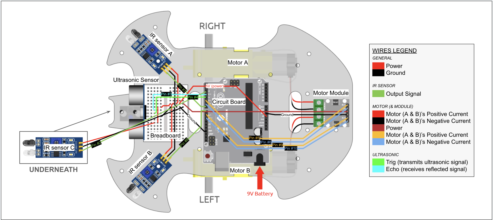
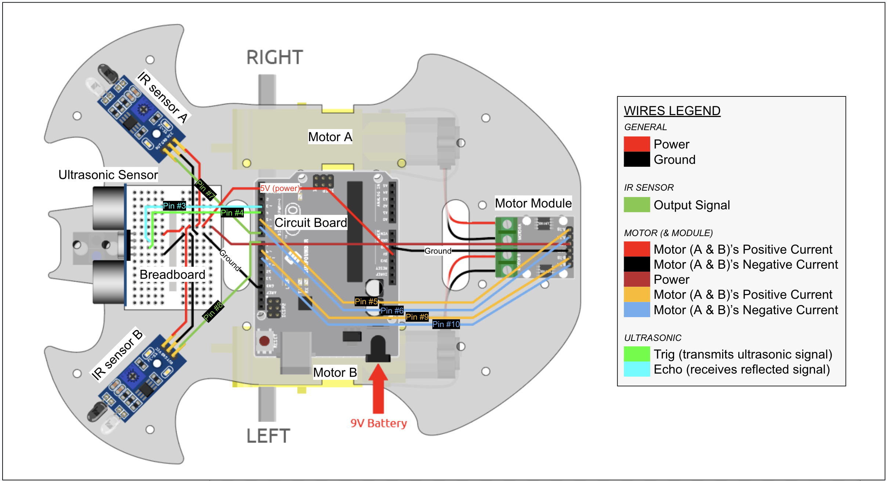

# Human Following Robot
This portfolio follows my progress over the summer as I worked on numerous projects. It tracks the numerous challenges I had to overcome and notes the milestones I hit. I started my summer by putting together a retro tetris arcade console, which was a simple yet tedious task as it required much soddering. For my intensive project, I built and programmed a robot designed to follow people around. This was a complex process that required much testing, constructing, wiring, coding, and adjusting. The main sensors I used were infrared sensors to detect objects nearby and an ultrasonic sensor to interpret the distance of objects from itself. My first modification after successfully building the robot ensured the robot would stop before identified edges.

| **Engineer** | **School** | **Area of Interest** | **Grade** |
|:--:|:--:|:--:|:--:|
| Zoya C. | Mission San Jose High School | Electrical Engineering | Incoming Junior

<!--Replace the BlueStamp logo below with an image of yourself and your completed project. Follow the guide [here](https://tomcam.github.io/least-github-pages/adding-images-github-pages-site.c++) if you need help.**

-->
  
# Modification #1: Detecting Edges
**DESCRIPTION:** When initially testing the robot's ability to follow me, one thing I would always need to be careful of is to make sure I wouldn not accidentally lead it off the table. As a result, I wanted my first modification to be adding a sensor to ensure it would stop before any cliffs, even if it sensed me. After all, what good is a pet robot with no survival instincts? 

**CHALLENGES:** One of the major challenges was that this modification was completely my own design. This meant I would have to figure out how and what sensor to add and how to code it. What made it even more difficult was that prior to this program, I had no coding or circuit-building experience. This meant any coding I did was based off patterns I had noticed from the code I had already been using. The same was true for the wiring. The sensor I decided to use was the IR sensor, which I tweaked slightly to be facing the ground. For the code, I modified it by instructing the robot to stop if this new sensor did not detect anything below it; the robot could not carry out its steering commands (left, right, forward), even if it sensed something nearby, so long as there was some sort of edge before it. 

**WHAT'S NEXT:** Now that I have completed my first modification, I plan on moving onto more difficult ones. I am unsure which one I would like to beging with, but I have many in mind. Examples include adding sensor to it's back to make it turn around and/or move backward, make it backup when it's too close to something, and making it remote control. I would like to start easy and slowly build myself up, meaning I will likely start with making it back up when it's too close.

# Modified Code

```c++
//assigining motor pins
const int A_1B = 5;
const int A_1A = 6;
const int B_1B = 9;
const int B_1A = 10;

//MODIFIATION: assigning IR edge pin
const int bottomIR=2;

//assigning IR obstacle pins
const int rightIR=7;
const int leftIR=8;

//assigning ultrasonic pins
const int trigPin = 3;
const int echoPin = 4;

void setup() {
  Serial.begin(9600);

  //defining motor pins
  pinMode(A_1B, OUTPUT);
  pinMode(A_1A, OUTPUT);
  pinMode(B_1B, OUTPUT);
  pinMode(B_1A, OUTPUT);

  //MODIFICATION: defining bottomIR pin
  pinMode(bottomIR,INPUT);

 //defining IR obstacle pins
  pinMode(leftIR,INPUT);
  pinMode(rightIR,INPUT);
  
  //defining ultrasonic pins
  pinMode(echoPin, INPUT);
  pinMode(trigPin, OUTPUT);
}

void loop() {
//assigning motor instructions to interpretations of Ultrasonic sensor information
  float distance = readSensorData();
    //for debugging, shows how far object is from ultrasonic sensor
    Serial.print(distance);
    Serialprintln("cm");
  delay(100);

//assigning motor instructions to interpretations of IR Obstacle sensor information
  int left = digitalRead(leftIR);       // 0: Obstructed   1: Empty
  int right = digitalRead(rightIR);
  int edge = digitalRead(bottomIR);    //MODIFICATION: assigning motor instructions to interpreted bottom sensor data
  int speed = 150;
  Serial.println (left);              //for debugging, shows left sensor is working (will print 0 or 1 as instructed)
  Serial.println (right);             //for debugging, shows right sensor is working (will print 0 or 1 as instructed)

//MODIFICATION: prioritizing stopping if edge detected + requiring all instructions to only work if the sensor can detect something below it
if (edge){                                //MODIFICATION: 1st priority: robot stops if no ground detected below it
    stopMove();
    Serial.println(edge);                 //MODIFICATION: prints edge on serial monitor if command works for debugging
  }else if (distance>5 && distance<20){
    moveForward(speed);
  }else if(!left&&right&&!edge){          //MODIFICATION: robot only turns to you if  ground detected below it
    turnLeft(speed);
  }else if(left&&!right&&!edge){          //MODIFICATION: robot only turns to you if ground detected below it
    turnRight(speed);   
  }else{
    stopMove();
  }
delay(100);
}

//defining ultrasonic sensor readings
float readSensorData() {
  digitalWrite(trigPin, LOW);
  delayMicroseconds(2);
  digitalWrite(trigPin, HIGH);
  delayMicroseconds(10);
  digitalWrite(trigPin, LOW);
  float distance = pulseIn(echoPin, HIGH) / 58.00; //Equivalent to (340m/s*1us)/2
  return distance;
}

//defining motor instructions
void moveForward(int speed) {
  analogWrite(A_1B, 0);
  analogWrite(A_1A, speed);
  analogWrite(B_1B, speed);
  analogWrite(B_1A, 0);
  Serialprint.ln("Forward");   //for debugging, shows motor is moving correctly and sensor is being read correctly; will print Forward when moving forward
}

void turnRight(int speed) {
  analogWrite(A_1B, speed);
  analogWrite(A_1A, 0);
  analogWrite(B_1B, speed);
  analogWrite(B_1A, 0);
 Serialprint.ln("Right")     //for debugging, shows motor is moving correctly and sensor is being read correctly; will print Right when turning right
}

void turnLeft(int speed) {
  analogWrite(A_1B, 0);
  analogWrite(A_1A, speed);
  analogWrite(B_1B, 0);
  analogWrite(B_1A, speed);
 Serialprint.ln("Left")     //for debugging, shows motor is moving correctly and sensor is being read correctly; will print Left when moving Left
}

void stopMove() {
  analogWrite(A_1B, 0);
  analogWrite(A_1A, 0);
  analogWrite(B_1B, 0);
  analogWrite(B_1A, 0);
 Serialprint.ln("Stop")     //for debugging, shows motor is moving correctly and sensor is being read correctly; will print Stop when stopped/stopping
}
```

# Modified Schematics



# Final Milestone: Coding

<iframe width="560" height="315" src="https://www.youtube.com/embed/6Max72kHgqk?si=7P0bIYm07S1jpWlh" title="YouTube video player" frameborder="0" allow="accelerometer; autoplay; clipboard-write; encrypted-media; gyroscope; picture-in-picture; web-share" referrerpolicy="strict-origin-when-cross-origin" allowfullscreen></iframe>

**DESCRIPTION:** To wrap up this project, I had to implement the code in order to make it follow my hand. I had to make sure all the pins matched up and all the signals were read and interpreted properly. I also had to make sure all the components were probably defined, interpreted, assigned, etc. The directions to follow my hand from the front was based on ultrasonic sensor's readings. If it detected something within 5-20 cm of the sensor, it would move towards it until it was out of range. It could also turn left or right to face me if either of the IR sensors detected something near it (and then it would move forward based on the previous instructions for the ultrasonic sensor readings).


**CHALLENGES:** Since the pins are all very close together on the circuitboard, it is also very easy to misalign them physically. The trickiest part was probably debugging due to the sheer amount of instructions and wires. I debugged using the serial monitor to print out what it read from the sensors in order to figure out which sensors were working and which ones did not. After I figured out which sensors and/or commands were not working, I had to make sure each and every one of its wires, as well as its parts (eg. for the IR sensor, the transmitters and receivers might need to be tweaked) were working and plugged in correctly. One obstacle was that for female-female jumper wires, the one with rectangular ends as opposed to the rounded ones tend to be more reliable. While debugging, I noticed the rounded ends were causing power issues for the sensors. The rectangular ending wires stay in place better and they also plug in all the way properly. However, it is important to be aware that their ends are more flexible, so they can also snap off more easily (which did happen when attaching the motor wires during milestone #2). 


**WHAT'S NEXT:** Now that I know how to build and code these parts, as well as fix their issues when they arise, I would like the modify the robot to be able to detect when I am behind it to either back up or turn around to continue following me. Now that I have finished building my project, the next thing to do is add my own modifications.

# Code
<!--Here's where you'll put your code. The syntax below places it into a block of code. Follow the guide [here]([url](https://www.markdownguide.org/extended-syntax/)) to learn how to customize it to your project needs.-->

```c++
//assigining motor pins
const int A_1B = 5;
const int A_1A = 6;
const int B_1B = 9;
const int B_1A = 10;

//assigning IR obstacle pins
const int rightIR=7;
const int leftIR=8;

//assigning ultrasonic pins
const int trigPin = 3;
const int echoPin = 4;

void setup() {
  Serial.begin(9600);

  //defining motor pins
  pinMode(A_1B, OUTPUT);
  pinMode(A_1A, OUTPUT);
  pinMode(B_1B, OUTPUT);
  pinMode(B_1A, OUTPUT);

  //defining IR obstacle pins
  pinMode(leftIR,INPUT);
  pinMode(rightIR,INPUT);
  
  //defining ultrasonic pins
  pinMode(echoPin, INPUT);
  pinMode(trigPin, OUTPUT);
}

void loop() {
//assigning motor instructions to interpretations of Ultrasonic sensor information
  float distance = readSensorData();
    //for debugging, shows how far object is from ultrasonic sensor
    Serial.print(distance);
    Serialprintln("cm");
  delay(100);

//assigning motor instructions to interpretations of IR Obstacle sensor information
  int left = digitalRead(leftIR);     // 0: Obstructed   1: Empty
  int right = digitalRead(rightIR);
  int speed = 150;
  Serial.println (left);              //for debugging, shows left sensor is working (will print 0 or 1 as instructed)
  Serial.println (right);             //for debugging, shows right sensor is working (will print 0 or 1 as instructed)

// if ultrasonic sensor detects something within 5-10cm, it will move forward
if (distance>5 && distance<10){
    moveForward(speed);
  }else if(!left&&right){
  // assuming the ultrasonic sensor didn't detect anything, if left IR sensor detects something + right IR sensor doesn't, it will turn left
    turnLeft(speed);
  // assuming the ultrasonic sensor didn't detect anything, if right IR sensor detects something + left IR sensor doesn't, it will turn right
  }else if(left&&!right){
    turnRight(speed);
  // if none of these occur, the robot will stay in place
  }else{
    stopMove();
  }
delay(100);
}

//defining ultrasonic sensor readings
float readSensorData() {
  digitalWrite(trigPin, LOW);
  delayMicroseconds(2);
  digitalWrite(trigPin, HIGH);
  delayMicroseconds(10);
  digitalWrite(trigPin, LOW);
  float distance = pulseIn(echoPin, HIGH) / 58.00; //Equivalent to (340m/s*1us)/2
  return distance;
}

//defining motor instructions
void moveForward(int speed) {
  analogWrite(A_1B, 0);
  analogWrite(A_1A, speed);
  analogWrite(B_1B, speed);
  analogWrite(B_1A, 0);
  Serialprint.ln("Forward");   //for debugging, shows motor is moving correctly and sensor is being read correctly; will print Forward when moving forward
}

void turnRight(int speed) {
  analogWrite(A_1B, speed);
  analogWrite(A_1A, 0);
  analogWrite(B_1B, speed);
  analogWrite(B_1A, 0);
 Serialprint.ln("Right")     //for debugging, shows motor is moving correctly and sensor is being read correctly; will print Right when turning right
}

void turnLeft(int speed) {
  analogWrite(A_1B, 0);
  analogWrite(A_1A, speed);
  analogWrite(B_1B, 0);
  analogWrite(B_1A, speed);
 Serialprint.ln("Left")     //for debugging, shows motor is moving correctly and sensor is being read correctly; will print Left when moving Left
}

void stopMove() {
  analogWrite(A_1B, 0);
  analogWrite(A_1A, 0);
  analogWrite(B_1B, 0);
  analogWrite(B_1A, 0);
 Serialprint.ln("Stop")     //for debugging, shows motor is moving correctly and sensor is being read correctly; will print Stop when stopped/stopping
}
```

# Second Milestone: Wiring/Construction

<iframe width="560" height="315" src="https://www.youtube.com/embed/_HQk5TEfqqU?si=H7X6gfRgMYlOd3nm" title="YouTube video player" frameborder="0" allow="accelerometer; autoplay; clipboard-write; encrypted-media; gyroscope; picture-in-picture; web-share" referrerpolicy="strict-origin-when-cross-origin" allowfullscreen></iframe>

**DESCRIPTION:** To reach this milestone, I had to put the actual robot together. This consisted mostly of screwing parts to the robot's acrylic board and then wiring all of them to the breadboard and/or the ADRUINO circuitboard I attached. To me, this project has really helped made coding and robotics less intimidating. It has showed me how simple it can be when I try breaking all the processes down into smaller, more digestable steps. 


**CHALLENGES:** There were no serious complications, but I did have to sodder the positive current wire for Motor A to a new male end because its original male end had snapped. The most frustrating part of this process came from screwing everything to the wrong side, meaning I had to start from scratch. Additiionally, the screws were on the smaller side, so without a wrench, it could be challenging trying to hand fix the nuts and standoffs. The wiring was pretty simple, but I needed to be careful that they were long enough and were not too entangled. It was also important to make sure the positive and negative wires for the motor were plugged into ground and power circuits accordingly to prevent shortcircuiting. Similar to this, it is important to make sure the ground part of the circuit was not accidentally attached to the power part as they were very close together on the breadboard, which would also result in a shortcircuit. 


**WHAT'S NEXT:** Now that I have completed wiring and construction, I need to figure out and test the codes in order to make the robot work. I may need to make my own additions to it for debugging in case anything goes wrong.

# Schematics 

<!--Here's where you'll put images of your schematics. [Tinkercad](https://www.tinkercad.com/blog/official-guide-to-tinkercad-circuits) and [Fritzing](https://fritzing.org/learning/) are both great resoruces to create professional schematic diagrams, though BSE recommends Tinkercad becuase it can be done easily and for free in the browser.-->




# First Milestone: Testing Components

<iframe width="560" height="315" src="https://www.youtube.com/embed/CAFV6XYA0hU?si=x979owAFFp9I4_uh" title="YouTube video player" frameborder="0" allow="accelerometer; autoplay; clipboard-write; encrypted-media; gyroscope; picture-in-picture; web-share" referrerpolicy="strict-origin-when-cross-origin" allowfullscreen></iframe>

**DESCRIPTION:** My intensive project is a robot on wheels that can follow people around. I am relatively inexperienced in the robotics field, so I began my project by testing several parts and their corresponding programs for my first milestone in order to gain a greater understanding of them. I began by watching several videos on the ARDUINO circuitboard and how its software runs before I moved onto more hands-on projects, using the ARDUINO R3 circuitboard with jumper wires for all of them. 

**CHALLENGES:** This was pretty straightforward and simple, but I did sometimes run into some difficulties with the fragility of the adapter, especially when I wanted to run all the projects all at once. To fix this, I would need to unplug the adapter and USB cable several times until the ARDUINO board connected to my laptop properly. 

**WHAT'S NEXT:** Now that I have reached this milestone, I need to build the robot and attach all the wires to connect all the parts together in order to achieve my second one. Since I've learned how each of these parts work, it will be easier to improvise if needed.

- ***LED Lights:*** For my first test, I put together a simple circuit to test the LED lights in this set, along with the code to make the light flash. Since the light has a positive and negative side, it is very important to make sure that the negative node is connected to the ground while the other is connected to power.

  SCHEMATICS:


  CODE:
  
```c++
//naming the pin the LED light is plugged into
const int ledPin = 9;

void setup()
{
  //initialize the digital pin as an output
  pinMode(ledPin,OUTPUT);
}

//the loop routine runs over and over again forever
void loop()
{
  digitalWrite(ledPin,HIGH);//turn the LED on 
  delay(500);               //wait for half a second (# corresponds miliseconds)
  digitalWrite(ledPin,LOW); //turn the LED off
  delay(500);               //wait for half a second
}
```

- ***Buzzer:*** The next project sought to find out how the buzzer worked. The setup of the two projects, as well as the coding, was very similar. The main differences could be found in the lack of a resistor (and obviously the component's function). The buzzer also has different polarities, like the LED light, so it's important to check for the same things.
  SCHEMATICS:

   

  CODE:
  
```c++
//naming the pin the buzzer is plugged into (the pin doesn't necessarily need to be a specific name, as long as the code # corresponds to the circuit's pin # being used)
const int buzzerPin = 8;

void setup()
{
  pinMode(buzzerPin, OUTPUT);
}

void loop()
{
    digitalWrite(buzzerPin, HIGH);
    delay(1000);
    digitalWrite(buzzerPin, LOW);
    delay(1000);                  //time doesn't have to be different from LED, just a suggestion since it's loud :)
  }
```

- ***Motor:*** While having the same fundamentals as the previous projects, this was slightly more complicated as there were more componenents to the motor to put together. It requires an additional motor module because the ARDUINO board does not have enough power for the motor to work. Though it has enough voltage for two motors (as you will see later), I decided to test only one for now. The motor itself had two wires that required a screwdriver in order to be plugged into the motor module. These wires were for the motor's positive and negative currents to control which way the motor would rotate.
  SCHEMATICS:

   
   
  CODE:
  
```c++
const int B_1A = 9;
const int B_1B = 10;

void setup()
{
  pinMode(B_1A, OUTPUT);
  pinMode(B_1B, OUTPUT);
}

void loop()
{
  //rotates motor clockwise
  digitalWrite(B_1A, HIGH);
  digitalWrite(B_1B, LOW);
  delay(2000);

  //stops motor
  digitalWrite(B_1A, LOW);
  digitalWrite(B_1B, LOW);
  delay(500);

  //rotates motor counterclockwise
  digitalWrite(B_1A, LOW);
  digitalWrite(B_1B, HIGH);
  delay(2000);

  //stops motor (again)
  digitalWrite(B_1A, LOW);
  digitalWrite(B_1B, LOW);
  delay(500);
}
```


- ***IR Obstacle Avoidance:*** This sensor senses obstacles by transmitting IR rays and receives them when a surface (of an object) reflects them back. If the serial monitor was opened, a 1 would correspond with no nearby object, while a 0 would alert me if there was. One of the green lights on the sensor also turns on to show the same thing.

  SCHEMATICS:

   

  CODE:
  
```c
int irObstaclePin = 2;

void setup() {
  Serial.begin(9600);
  pinMode(irObstaclePin, INPUT);  //assigns pin & mode
}

void loop() {
  Serial.println(digitalRead(irObstaclePin));  //digitalRead: reads designated pin's signal as high or low
  delay(10);
}
```

- ***Ultrasonic Sensor:*** This works similar to the IR sensor, but instead uses ultrasonic frequencies in order to detect how far objects are. This works by emitting sound waves (too high for human ears to pick up, don't worry), and receiving these waves when they are reflected back. The distance is then calculated (in centimeters) based on how long it took for the waves to reflect back and be received.

  SCHEMATICS:

   
   
  CODE:
  
```c++
const int echoPin = 3;
const int trigPin = 4;


void setup(){
  Serial.begin(9600);
  pinMode(echoPin, INPUT);
  pinMode(trigPin, OUTPUT);
  Serial.println("Ultrasonic sensor:");  
}

void loop(){
  float distance = readSensorData();
  //shows objects distance (in cm) from sensor
 Serial.print(distance);   
  Serial.println(" cm");
  delay(400);
}

float readSensorData(){
  //trigger pin sends wave signal every 2us
  digitalWrite(trigPin, LOW); 
  delayMicroseconds(2);
  //trigger pin transmits 10us square wave
  digitalWrite(trigPin, HIGH); 
  delayMicroseconds(10);
  digitalWrite(trigPin, LOW);
  //echo pin receives high signal when obstacle is in range, then records time from start-receive w/ pulseIn
  float distance = pulseIn(echoPin, HIGH)/58.00;  //Equivalent to (340m/s*1us)/2, which is the speed of sound
  return distance;
}
```

# Starter Project: Tetris Arcade Console

 

<iframe width="560" height="315" src="https://www.youtube.com/embed/xC3nwDxYMC0?si=Qx-B4X6S6Iq_OcWs" title="YouTube video player" frameborder="0" allow="accelerometer; autoplay; clipboard-write; encrypted-media; gyroscope; picture-in-picture; web-share" referrerpolicy="strict-origin-when-cross-origin" allowfullscreen></iframe>
 
**DESCRIPTION:** In preperation for the hardware aspects of my intensive projects, I warmed up by putting together a retro arcade console designed to play numerous games of tetris. It can be powered by either batteries or your laptop by connecting it via the USB socket. You then start a game by turning on the red power button and pressing the yellow button labeled with a square. The game is displayed on the dot matrix, and the pieces can be controlled by the four buttons labeled with arrows. While you play, the digital cube keeps track of your score, and the buzzer provides sound effects/music. The game can be ended with the button labeled X, pressing the power button, or disconnecting the power source. Every component was soddered on, and the non-electrical parts were screwed together.


**CHALLENGES:** The main obstacle for this project was the amount of tedious soddering required. The dot matrix, digital tube, and power switch were relatively simpler. The challenge from these parts was that they had numerous parts to sodder--most of which were very close together. This meant having to meticulously sodder without accidentally connecting two holes together. Other parts, however, did not fit into the circuitboard's holes as perfectly. As a result, I had to pay careful attention to how much sodder I added and how it was added. The wires, for example, had to be held while soddering because the wires were way too small incomparison to the holes and could also come apart and require retwisting. Additionally, the wires were much longer and would move around if not held. A slight concern was burning the circuitboard when adjusting sodder/desoddering, but this went away with time and practice. Putting together the outer parts was a straightforward task, but could sometimes be confusing since it was more difficult to tell if some screws were fully screwed.


**WHAT'S NEXT:** Now that I have finished my starter project, I can look forward to working on my intensive project: building a human following robot. My immediate next steps are testing all the components of it, such as the sensors and motors, as well as gaining a better understanding of the ARDUINO coding software.


# Bill of Materials
<!--Here's where you'll list the parts in your project. To add more rows, just copy and paste the example rows below.
Don't forget to place the link of where to buy each component inside the quotation marks in the corresponding row after href =. Follow the guide [here]([url](https://www.markdownguide.org/extended-syntax/)) to learn how to customize this to your project needs.-->

| **Part** | **Note** | **Price** | **Link** |
|:--:|:--:|:--:|:--:|
| Tetris Arcade Console | soddering practice | $18.99 | <a href="https://www.amazon.com/Classic-Electronic-Soldering-Tetris-Machine/dp/B07HB3HPPJ/ref=asc_df_B07HB3HPPJ?mcid=b00b7893f57d3a19abc2f6c187ac48cd&hvocijid=17279151866651341911-B07HB3HPPJ-&hvexpln=73&tag=hyprod-20&linkCode=df0&hvadid=721245378154&hvpos=&hvnetw=g&hvrand=17279151866651341911&hvpone=&hvptwo=&hvqmt=&hvdev=c&hvdvcmdl=&hvlocint=&hvlocphy=9032171&hvtargid=pla-2281435179298&th=1"> Link </a> |
| SunFounder 3-in-1 Starter Kit for ARDUINO UNO R3 | car parts, including motorized wheels, universal wheel, screws, acrylic board, etc (all other items besides starter project components can be found here too) | $59.99 | <a href="https://www.amazon.com/SunFounder-Compatible-Tutorials-Including-Controller/dp/B0B778L1DZ/ref=sr_1_1?crid=39SRRE6NUPJ6I&dib=eyJ2IjoiMSJ9.D9LrCZJnua_keVMLJz2FWuvSD9IFJ4iV0OAGcDwLKXQDokdkjSabj-88ReuH07RR4Rbu0Wgxnox9Q0WPLRKJJQ.hO2JiQIlAVZg-_K_CWNuP5PwWk7o5Y6-l8S8KmZaGxA&dib_tag=se&keywords=sunfounder+3+in+1&qid=1750974630&sprefix=sunfounder+3+in+1%2Caps%2C165&sr=8-1"> Link </a> |
| USB-USB C Adapter | connect the circuitboard to your laptop (macbooks will not have a USB port) | $6.99 | <a href="https://www.amazon.com/Temdan-USB-Adapter-SuperSpeed-Transfer/dp/B0BMVHHT47/ref=sr_1_10?crid=A8MBXIFU281U&dib=eyJ2IjoiMSJ9.oPbvaxzW0fyN1JYgStVSCr9CPF1gxAioUEgWE_SkT0wXWN6wJKANjF_1PSdP1eGIUUyel_G16a6_o585vJAiIvj3gZF52aNP0FMx2_sPy_WlM7E1PD0Vh0GH2cYEBNcPnYvclyI9ThFcN3kWr5WeneuHDBgN1itkMDJgkxXpQ-Xm6pggueEW0O6e2yEkkjD7K8F5KWB0984JnwZN79GrhVJuVb9ij-eg1CX3nF_qVyM.WQ_NlQMKdFtMIa8aN7J-J6qFvtLP9tprdnHr0eTaA6c&dib_tag=se&keywords=usb%2Badapter&qid=1750976693&sprefix=usb%2Badapte%2Caps%2C140&sr=8-10&th=1"> Link </a> |
| ARDUINO R3 Board | circuitboard for robots + all testing | $8.99 | <a href="https://www.amazon.com/ATmega328P-Arduino-Compatible-Arduino-Voltage-Compatible/dp/B0D83J2TJJ/ref=sr_1_4?crid=329T2WYWAI29F&dib=eyJ2IjoiMSJ9.PA5bTsvC-SwWQIJ_zNvJdvU6r6Xl6cFkTsg5XnmAvAFh41QZewvvJmzXkKbv8m0EyyZbgTGmcQkdD3h3Zpwrt6nbN28WBbHnnhMSzQhGCCfOKTKHm0BxDPjmC0DpAZYl_xEuBuNL9Gkkawj8466LPtGLDJH1HqkrpThxD1FuFVEXG0qAFSEVM-9ib-QBDKtePlFQ_YDxs6LRa144m9JZS_cEvc1FsIxAabpavImW1No.0frZfOYgexyEQLRvyVLwEK52rqLFle6n8p3cX1XnVuk&dib_tag=se&keywords=arduino%2Br3%2Bcircuit%2Bboard&qid=1750973672&sprefix=%2Caps%2C93&sr=8-4&th=1"> Link </a> |
| Breadboard | connects all parts to circuitboard | $6.19 | <a href="https://www.amazon.com/Chlmetf-Breadboard-Breadboards-Bundles-Flexible/dp/B0DSS4QWM1/ref=sr_1_11?crid=M4P9SETSWDAN&dib=eyJ2IjoiMSJ9.5Z5yTwL-oa1r18Ah_zf9OXg0u1AVX54R3VfgSdqpBoSGPnQIrACToU02yfhw-Mp8QzU0B4nbdiUiYNfL_A1cebv19IBUJa73iSfGnpVNzbkpuE8-EML7ngxL9O3GmzyCW2BOv1hpjJrqa5_6ZwTNqKmEVSnGiisEYr0cX4It9WDbCu_yWZ7GO5E679U3phBnBMN28_jIF3D6NrM05ehNEqycwkOJK9Rz15s804YNm8Y.l6EJBnKvDl9H8tJqjhM2MX-_0Wu6xl-mmCBb3BpbON8&dib_tag=se&keywords=breadboard&qid=1750974317&sprefix=breadboar%2Caps%2C212&sr=8-11"> Link </a> |
| Jumper Wires | connecting components to boards | $6.98 | <a href="https://www.amazon.com/Elegoo-EL-CP-004-Multicolored-Breadboard-arduino/dp/B01EV70C78/ref=sr_1_1?crid=3B0JET5S3B8KZ&dib=eyJ2IjoiMSJ9.I3nSspk5onl8Jong0G-0Eej0s1agLXJoNbNWfIFXRRAY9IgBhFFYUU-ai_9I1dEIHE49Z9DPtLxKexe54VQGbkpoX-RHudyEMxZWyHI-uCHaL24mZOYSxXIHBkGbJpkLxLrh-Fxi2CI5fXiycQvwNnMKoVyBi0k--RiSy6f0H5V1Z8Fvtfz6Ad6SPNK8g-JuszLI9IES2gmnwmp4zH_w2aV0a-BSGUA-VWdEyFeRi6U.wTsweHoLGXJAYK1mGwHWTOWqxpJfkr7-IrP8NWm8dIs&dib_tag=se&keywords=jumper+wires&qid=1750974887&sprefix=jumper+wire%2Caps%2C171&sr=8-1"> Link </a> |
| L9110 Motor Driver Module | drives both motors simultaneously | $4.99 | <a href="https://www.amazon.com/VKLSVAN-H-Bridge-Channel-Stepper-Controller/dp/B0DQPRLTBD/ref=sr_1_4?crid=2FQI8NJEQ4DC0&dib=eyJ2IjoiMSJ9.3hJQtz2H_a0DvMbcXALLpQhQuKIy7jZ9cjX7Fq0q8hTFnY8rwOs17t5iJ_i326kNN-K_ZXtXji34V8VsE4ZSs6wjD4yU6Lc-5o2elh7g43QzWB-_YL_YAcC9RcWikX1_-ncVU66XAJnNr8EPbtesW8heIlLjy0AN1NvMl3LUuTWoRhGwC7SSEnuQsjT-HKaX3toeODkH8v1t0PWGLrTrTKtx5WRfqT7Ipl-pdXCRj9A.lHilYeAXkbHlIpGbXfGZymamMVciccmyZxULci5a0HE&dib_tag=se&keywords=L9110%2BMotor%2BDriver%2BModule&qid=1750973920&sprefix=l9110%2Bmotor%2Bdriver%2Bmodule%2Caps%2C113&sr=8-4&th=1"> Link </a> |
| TT Motor | steers wheels | $6.99 | <a href="https://www.amazon.com/Diann-Motor-Gearbox-200RPM-Ratio/dp/B0BR7S2TRY/ref=sr_1_6?crid=16M86V4H4P4ZK&dib=eyJ2IjoiMSJ9.VFvmjZ6X2lLerHG6wM2_Zwfl36qWgxmR6GprDkLz0198ub_96M_N_PwwtBiw0QYHCqn5D2B56Ne-AT1_2_6bqMC0Q0hd9BRdbp2LcLLevHT96hwQTEU-zadr0u-ZAdGezeOydZa2ONGgoeo2k2jBtctBSUwxtLXPJHBAdKNTZ1II-w8MaXdSBJoM3guWAm-Mi9O5KtjSWC9vU3uxE0e2oKa94nyrzgoKzem-1qBLHqPfSKCKSHFiF6LeIm-Z2YW8hgAhMYIaA1eEl7Rh9XjzJy1dcLrO9ryUF3z7htioAJM.ynogUApaD90MYh606c3q_q7LJGSOhP8hA-8U-XCv51o&dib_tag=se&keywords=TT%2Bmotor&qid=1750974073&sprefix=tt%2Bmotor%2Caps%2C183&sr=8-6&th=1)"> Link </a> |
| Ultrasonic Sensor | detects distance from an object | $6.99 | <a href="https://www.amazon.com/WWZMDiB-HC-SR04-Ultrasonic-Distance-Measuring/dp/B0B1MJJLJP/ref=sr_1_3?crid=10A3ZPKR43D2P&dib=eyJ2IjoiMSJ9.0VlpR5An1rDHrKsyEwXFZf4g67ELu997flI4iC_UhX5L30tFFCz7cQnhbt9liS7tkdN6s-XqAfzVphzD4J46FFVc2fHpLn9TkIT5rXIQyoDSBnLaaJ5gwJylrYoZocO-guoy7yUnUwiAdbYg_BYg4SwkYhIAueZ6Cksh2S7Cmyb_TpuA8P5-1IzqJpUljr2yTS_qt2XyEMdpLjduaSUZZ5dKlADLPycmJKbtg2C3ZK4.mVJ2U5mtWMNF4pQTBDcZBgM0B9PM8qa0qv1w4K7Ln2g&dib_tag=se&keywords=Ultrasonic+sensor&qid=1750974160&sprefix=ultrasonic+sensor%2Caps%2C151&sr=8-3"> Link </a> |
| Obstacle Avoidance Module | detects if an object is within a desired range | $5.99 | <a href="https://www.amazon.com/WWZMDiB-TCRT5000-Reflective-Photoelectric-Avoidance/dp/B0BDDBM2TR/ref=sr_1_7?crid=314JNOY703NDE&dib=eyJ2IjoiMSJ9.Xj9IhGOOzwBMNc-6r4uk6H9Ub2nW5L8WBfqhJ996lyBNK3fNnzpYFisQw2CqYnEjIxmlNuHf7ynVCCJfSD5bgGLlhk_Of7fxhbvbLW-gSWKPRCHMqOKkdK1gZZSnoqiaw_FvCGdWnA0efW6-DiwmphUaMb6C3Cz734MLzq7pJW7_3l_XWruO9I8vRglpVIpd2KGaqEkLRP31BA-GHUYbVT6K8T0JHdSm6X1T33Up0QJIoJh14CuYdC7lImxql5b3vlhH8gpVe8Kyb4mpbnZwrQQ0IuMhGDvkbKLt5I5LqAw.qeLNnFe9YbXkYswh7sN4EO9Umc3Q3AwprN-2CzB35z8&dib_tag=se&keywords=Obstacle+Avoidance+Module&qid=1750974201&sprefix=obstacle+avoidance+modul%2Caps%2C139&sr=8-7"> Link </a> |
| Resistor | prevents shortcircuits (ensures voltage is not too high) | $4.59 | <a href="https://www.amazon.com/California-JOS-Resistance-CJ50-004-220/dp/B0BDKQSZHM/ref=sr_1_3?crid=PW9C3IZP9TJ5&dib=eyJ2IjoiMSJ9.pq8IXZtwkjU13efAoUQ012KAyknNA0lTscBiHFNwGQe5-6dKzzkxrUTVKn96kzmc9mUyL5d3GjDGP7PgotUTiRWI6uuaLqfyWFfV8WfPQW8rmwQScFRDdhyqcJOUtEaXguIbR8CIxvDeL9FuPxKty9hBcapiema5smYGMBmHVCNAba27FRHshpVaI3D_Cpg3vF4KTWWYFHExPrA_urVWR0y005THHbIj3AXmwkV58QU.0qXsOr9uGCg3n7iic8n96X2SAtplqLJGPDf8mtRGceM&dib_tag=se&keywords=220+ohm+resistor&qid=1750974966&sprefix=220%2Caps%2C149&sr=8-3"> Link </a> |
| LED light | testing codes & parts with lights | $3.97 | <a href="https://www.amazon.com/California-JOS-50-PCS-Colorful/dp/B0CR886L92/ref=sr_1_6?crid=2UDHKIDZ24PB8&dib=eyJ2IjoiMSJ9.8j3OanSWHKtLCAXnwT0t6BxCPwBne4LiOPlF2sgWgCc-HBlLRceMGDWPjPhKdl7WXB798eC9bWNKcfH490OAW80OvTxrBoxemYwLxAVes6R87_2-aojU2TzoSUYfQdn3xTypxtNLWch392Ch-q9o5EPHyCsfJDBLCWyRxOqtjllRgtfBy2KN51Wklhkp4jsw-RtcSfOeTeEKwYFTm-YeHYzisNQl6V5UB-VgEEH7Hmr2SJchTUTqX5wiUjF3QT6Mp1JHXDCCPDj9-EbssudHBTwutfaD-Sj4WWF72y0ef0c.-Y5mAuvbwrc452eW5sZZT9y3Z6iXM1D5HUG6OVrER5k&dib_tag=se&keywords=led%2Blight%2Bcircuit%2Bboard&qid=1750975066&sprefix=LED%2Blight%2Bcircuitbo%2Caps%2C132&sr=8-6&th=1"> Link </a> |
| Buzzer | testing codes & parts with sounds | $5.99 | <a href="https://www.amazon.com/Cylewet-Terminals-Electronic-Electromagnetic-Impedance/dp/B01NCOXB2Q/ref=sr_1_7?crid=FWFGOHKNHVM8&dib=eyJ2IjoiMSJ9.woH-ybv0Q271j8do6pCKsq8U4p2Q6dw5bj_mKVlHdy88rcT8jPbnakpIbPRzQ0oquX7QhROJtJetQh5uoaOL9Jy96PCdzIjs_7fN9Ryqx_VwTH-09dN5AKGh8R5Ww8v_z17QVwstWVtd1E9qboZWScWF7JKhj6jm9Sq07sXte3sucaRsaEJ6sE_CUYIiHodan0BNIyJ8I-eVk7NvKMvw8uJA-UnCBfnIoHKrADG9pix8kw8bW5NXLzcSaDgkLV6XcQpWD3tSBD5347bUvL1JxQHVqIBbC5GuLNIuPx8QBQ8.5JUaWfClyDYZ56Wxo4EodWmx6v5kmn2bXPxSN6MFTxc&dib_tag=se&keywords=buzzer+for+circuits&qid=1750975152&sprefix=buzzer+for+circuit%2Caps%2C137&sr=8-7"> Link </a> |


<!--# Other Resources/Examples
One of the best parts about Github is that you can view how other people set up their own work. Here are some past BSE portfolios that are awesome examples. You can view how they set up their portfolio, and you can view their index.md files to understand how they implemented different portfolio components.
- [Example 1](https://trashytuber.github.io/YimingJiaBlueStamp/)
- [Example 2](https://sviatil0.github.io/Sviatoslav_BSE/)
- [Example 3](https://arneshkumar.github.io/arneshbluestamp/)

To watch the BSE tutorial on how to create a portfolio, click here.-->
